# LIFE4136 Rotation 3
This is the github page for rotation 3 of LIFE4136, exploring ploidy and purity patterns in European Arabidopsis lyrata. Further to the work completed by Marburger et al., in 2019 (paper accessed here: https://www.nature.com/articles/s41467-019-13159-5) the contents of this repository specifically investigate trends which highlight if a sample population is an allopolyploid or autopolyploid. This research is to support the further investigation currently being completed by their team in whether alloploidy (attained via interspecific hybridisation) aids in stabilising meiosis and other processes that are disturbed during whole genome duplication (WGD). 

Arabidopsis arenosa is the sister species of Arabidopsis lyrata, both species exist in diploid and tetraploid states, Arabidopsis arenosa underwent WGD before Arabidopsis lyrata and such the hybridization of neo Arabidopsis lyrata tetraploids with Arabidopsis arenosa aided in the stabilisation of cell division. This happens because certain genes that are important for meiosis, as well as other cellular processes affected by WGD, are exchanged between different plant varieties during hybridization.

The below code is to be ran in alternating R, python and UNIX environments

## Dependencies:
* To run *Principle Component Analysis*, *Sample Mapping*, *Nei's Distance Calculations* and *Allele Frequency Plots* R Studio version 4.3.3 is needed, this can be downloaded here: https://cran.r-project.org/mirrors.html, simply navigate to your country and select the package compatible for your machiene. Secondary to this, the following R packages need to be installed for the code to run:
  *   adegenet version 2.1.10 or higher
  *   adegraphics version 1.0.21 or higher
  *   dplyr version 1.1.4 or higher
  *   ggplot2 version 3.4.4 or higher
  *   ggrepel version 0.9.5 or higher
  *   leaflet version 2.2.1 or higher
  *   StAMPP version 1.6.3 or higher
  *   tidyr version 1.3.0 or higher
  *   vcfR version 1.15.0 or higher


* Python 2 and 3
* UNIX
* gatk
* Conda
* Splits tree
* fastStructure
* structure plot?

## Files required:

* **vcf** with all your samples
* reference **fasta file** to which your reads were aligned to
* scripts provided above

## In R - load packages:
```
library(vcfR)
library(adegenet)
library(adegraphics)
library(tidyr)
library(dplyr)
library(ggplot2)
library(ggrepel)
library(StAMPP)
library(leaflet)
```
If any errors occur this may be because your R doesn't have the packages installed, if so use the **install.packages()** function - put the package name in the brackets.
## Set working directory:
```
setwd("[path_to_working_directory]")
```
## Read in vcf:
```
vcf <- read.vcfR("[title_of_vcf].vcf")
```
## Run initial PCA
This will allow for the discovery of potential trends in your data and allow for preliminary visualisation.
### Convert vcf into a genlight object
First create the function:
```
vcfR2genlight.tetra <- function (x, n.cores = 1) 
{
  bi <- is.biallelic(x)
  if (sum(!bi) > 0) {
    msg <- paste("Found", sum(!bi), "loci with more than two alleles.")
    msg <- c(msg, "\n", paste("Objects of class genlight only support loci with two alleles."))
    msg <- c(msg, "\n", paste(sum(!bi), "loci will be omitted from the genlight object."))
    warning(msg)
    x <- x[bi, ]
  }
  x <- addID(x)
  CHROM <- x@fix[, "CHROM"]
  POS <- x@fix[, "POS"]
  ID <- x@fix[, "ID"]
  x <- extract.gt(x)
  x[x == "0|0"] <- 0
  x[x == "0|1"] <- 1
  x[x == "1|0"] <- 1
  x[x == "1|1"] <- 2
  x[x == "0/0"] <- 0
  x[x == "0/1"] <- 1
  x[x == "1/0"] <- 1
  x[x == "1/1"] <- 2
  x[x == "1/1/1/1"] <- 4
  x[x == "0/1/1/1"] <- 3
  x[x == "0/0/1/1"] <- 2
  x[x == "0/0/0/1"] <- 1
  x[x == "0/0/0/0"] <- 0
  x[x == "0/0/0/0/0/0"] <- 0
  x[x == "0/0/0/0/0/1"] <- 1
  x[x == "0/0/0/0/1/1"] <- 2
  x[x == "0/0/0/1/1/1"] <- 3
  x[x == "0/0/1/1/1/1"] <- 4
  x[x == "0/1/1/1/1/1"] <- 5
  x[x == "1/1/1/1/1/1"] <- 6
  if (requireNamespace("adegenet")) {
    x <- new("genlight", t(x), n.cores = n.cores)
  }
  else {
    warning("adegenet not installed")
  }
  adegenet::chromosome(x) <- CHROM
  adegenet::position(x) <- POS
  adegenet::locNames(x) <- ID
  return(x)
}
```
Run the conversion:
```
aa.genlight <- vcfR2genlight.tetra(vcf)
```
Warnings may occur after this line, you can use the **warnings()** function to view the specifics, in my initial run 31 warnings occured all of which returned: 'In initialize(value, ...) : NAs introduced by coercion' meaning there was missing data in the vcf so NA values are introduced. You can inspect your VCF file to identify any missing or unexpected data that might be causing the issue, however at this stage the code can handle missing values and visualisation will still show trends.

Create individual id's and population names:
```
locNames(aa.genlight) <- paste(vcf@fix[,1],vcf@fix[,2],sep="_")
pop(aa.genlight)<-substr(indNames(aa.genlight),1,3) 
```
### Check your data - this section is optional
```
aa.genlight
```
This will tell you basic information about your genlight object, for example how many individuals in sample.

If you want to see the individual names: ```indNames(aa.genlight)```

If you want to see the populations and number of them, run: ```unique(pop(aa.genlight))```

If you want to see the variety of ploidy in sample, run: ```unique(ploidy(aa.genlight))```

### Run the PCA
Define the PCA function:
```
glPcaFast <- function(x,
                      center=TRUE,
                      scale=FALSE,
                      nf=NULL,
                      loadings=TRUE,
                      alleleAsUnit=FALSE,
                      returnDotProd=FALSE){
  
  if(!inherits(x, "genlight")) stop("x is not a genlight object")
  # keep the original mean / var code, as it's used further down
  # and has some NA checks..
  if(center) {
    vecMeans <- glMean(x, alleleAsUnit=alleleAsUnit)
    if(any(is.na(vecMeans))) stop("NAs detected in the vector of means")
  }
  if(scale){
    vecVar <- glVar(x, alleleAsUnit=alleleAsUnit)
    if(any(is.na(vecVar))) stop("NAs detected in the vector of variances")
  }
  # convert to full data, try to keep the NA handling as similar
  # to the original as possible
  # - dividing by ploidy keeps the NAs
  mx <- t(sapply(x$gen, as.integer)) / ploidy(x)
  # handle NAs
  NAidx <- which(is.na(mx), arr.ind = T)
  if (center) {
    mx[NAidx] <- vecMeans[NAidx[,2]]
  } else {
    mx[NAidx] <- 0
  }
  # center and scale
  mx <- scale(mx,
              center = if (center) vecMeans else F,
              scale = if (scale) vecVar else F)
  # all dot products at once using underlying BLAS
  # to support thousands of samples, this could be
  # replaced by 'Truncated SVD', but it would require more changes
  # in the code around
  allProd <- tcrossprod(mx) / nInd(x) # assume uniform weights
  ## PERFORM THE ANALYSIS ##
  ## eigenanalysis
  eigRes <- eigen(allProd, symmetric=TRUE, only.values=FALSE)
  rank <- sum(eigRes$values > 1e-12)
  eigRes$values <- eigRes$values[1:rank]
  eigRes$vectors <- eigRes$vectors[, 1:rank, drop=FALSE]
  ## scan nb of axes retained
  if(is.null(nf)){
    barplot(eigRes$values, main="Eigenvalues", col=heat.colors(rank))
    cat("Select the number of axes: ")
    nf <- as.integer(readLines(n = 1))
  }
  ## rescale PCs
  res <- list()
  res$eig <- eigRes$values
  nf <- min(nf, sum(res$eig>1e-10))
  ##res$matprod <- allProd # for debugging
  ## use: li = XQU = V\Lambda^(1/2)
  eigRes$vectors <- eigRes$vectors * sqrt(nInd(x)) # D-normalize vectors
  res$scores <- sweep(eigRes$vectors[, 1:nf, drop=FALSE],2, sqrt(eigRes$values[1:nf]), FUN="*")
  ## GET LOADINGS ##
  ## need to decompose X^TDV into a sum of n matrices of dim p*r
  ## but only two such matrices are represented at a time
  if(loadings){
    if(scale) {
      vecSd <- sqrt(vecVar)
    }
    res$loadings <- matrix(0, nrow=nLoc(x), ncol=nf) # create empty matrix
    ## use: c1 = X^TDV
    ## and X^TV = A_1 + ... + A_n
    ## with A_k = X_[k-]^T v[k-]
    myPloidy <- ploidy(x)
    for(k in 1:nInd(x)){
      temp <- as.integer(x@gen[[k]]) / myPloidy[k]
      if(center) {
        temp[is.na(temp)] <- vecMeans[is.na(temp)]
        temp <- temp - vecMeans
      } else {
        temp[is.na(temp)] <- 0
      }
      if(scale){
        temp <- temp/vecSd
      }
      res$loadings <- res$loadings + matrix(temp) %*% eigRes$vectors[k, 1:nf, drop=FALSE]
    }
    res$loadings <- res$loadings / nInd(x) # don't forget the /n of X_tDV
    res$loadings <- sweep(res$loadings, 2, sqrt(eigRes$values[1:nf]), FUN="/")
  }
  ## FORMAT OUTPUT ##
  colnames(res$scores) <- paste("PC", 1:nf, sep="")
  if(!is.null(indNames(x))){
    rownames(res$scores) <- indNames(x)
  } else {
    rownames(res$scores) <- 1:nInd(x)
  }
  if(!is.null(res$loadings)){
    colnames(res$loadings) <- paste("Axis", 1:nf, sep="")
    if(!is.null(locNames(x)) & !is.null(alleles(x))){
      rownames(res$loadings) <- paste(locNames(x),alleles(x), sep=".")
    } else {
      rownames(res$loadings) <- 1:nLoc(x)
    }
  }
  if(returnDotProd){
    res$dotProd <- allProd
    rownames(res$dotProd) <- colnames(res$dotProd) <- indNames(x)
  }
  res$call <- match.call()
  class(res) <- "glPca"
  return(res)
}
```
Run the PCA:
```
pca.1 <- glPcaFast(aa.genlight, nf=300)
```
Create a colour palette:
```
col <- funky(10)
```
Plot the PCA:
```
s.class(pca.1$scores, pop(aa.genlight), xax=1, yax=2, col=transp(col,.6), ellipseSize=0, starSize=0, ppoints.cex=4, paxes.draw=T, pgrid.draw =F, xlab = "PC1", ylab = "PC2")
```
This is what my first PCA looked like:

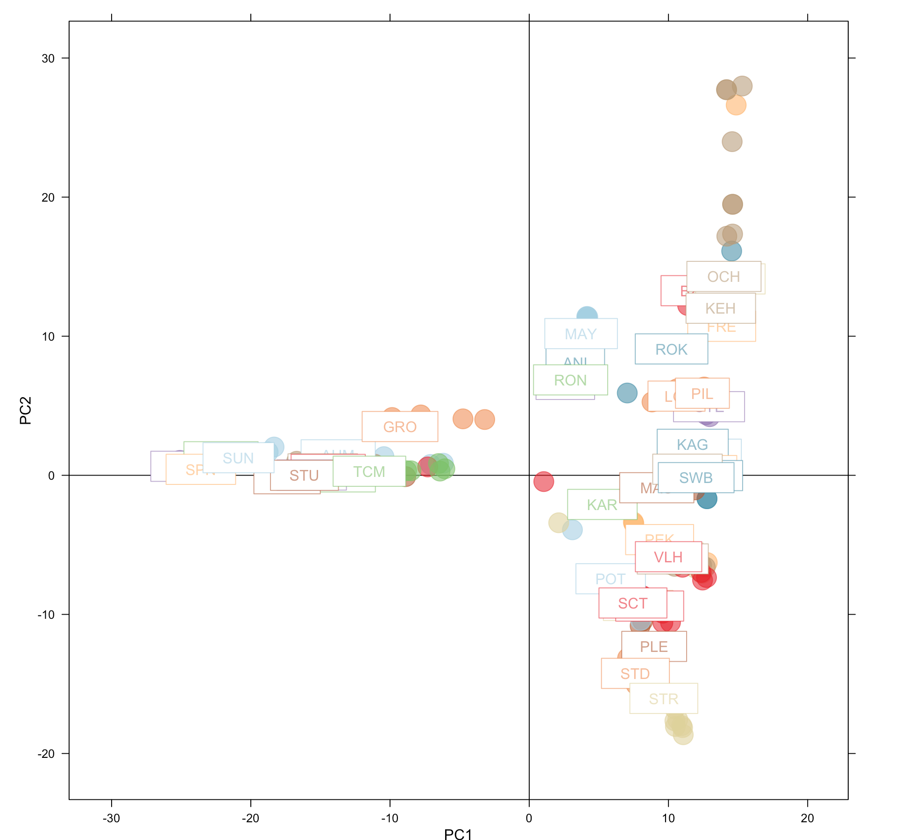

For reference, this figure from the Marburger paper *(linked at the top of the page)* shows some information on ploidy and purity of the data I am looking at (not all populations are included in this paper):

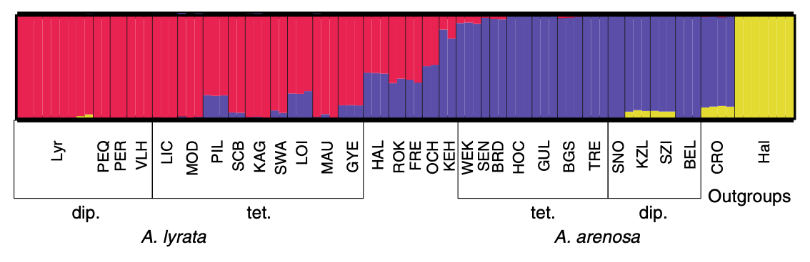

At first it is difficult to see trends.

Try colouring by ploidy:

```
ploidy_labels <- factor(ploidy(aa.genlight))
s.class(pca.1$scores, ploidy_labels, xax=1, yax=2, col=transp(col,.6), ellipseSize=0, starSize=0, ppoints.cex=4, paxes.draw=T, pgrid.draw =F, xlab = "PC1", ylab = "PC2")
```
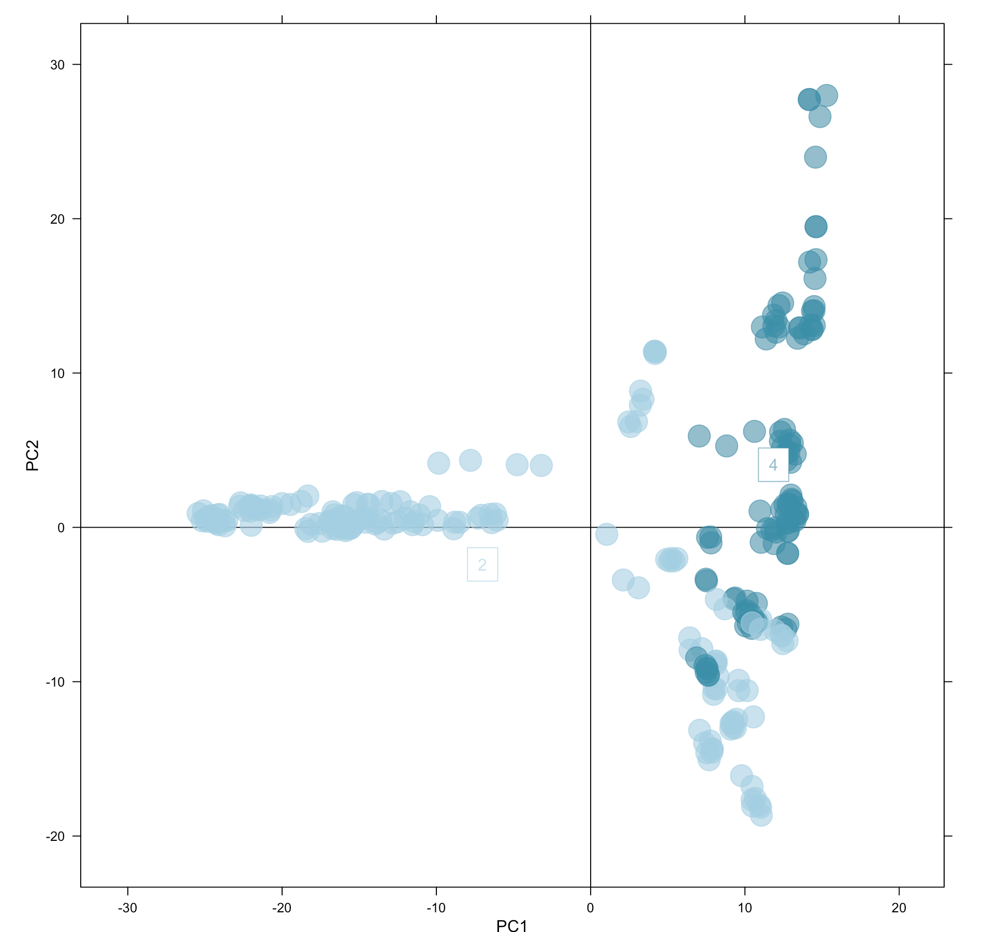

As you can see PC1 seems to relatively seperate diploids and tetraploids and PC2 hybrids from pure lyrata. However, this isnt a perfect pattern, many diploids cluster positively with PC1 (with the tetraploids). Furthermore, the tetraploids include hybrids (mixture of lyrata and arenosa) and a population genetically similar to arenosa (KEH). In the diploid population there are only pure lyrata, this means that the PCA could be unbalanced as there are no arenosa diploids to balance out the arenosa tetraploids.

## Now lets run a PCA on only tetraploids:

### Filter your vcf with gatk - in a UNIX environment

You can dowload gatk using the instructions provided here: https://github.com/broadinstitute/gatk?tab=readme-ov-file#downloading **warning** this is a large package, if you have access to a HPC it would be better to run this section on that.

Create a virtual environment: ```conda create --name /[path_to_virtual_environment]/[virtual_environment_name]```

Activate your gatk environment: ```conda activate /[path_to_virtual_environment]/[virtual_environment_name]```

Index your reference fasta file: ```samtools faidx [name_of_your_reference_file].fasta```

Create a dictionary file from your reference fasta: ```gatk CreateSequenceDictionary -R [name_of_your_reference_file].fasta```

Create a filtered .args file with the populations you wish to include (in this example I filter for only tetraploids): ```grep -o -E 'BZD-....|PEK-....|SCT-....|TEM-....|GYE-....|JOH-....|KAG-....|LIC-....|LOI-....|MAU-....|MOD-....|PIL-....|SCB-....|SWB-....|HAB-....|ROK-....|FRE-....|OCH-....|KEH-....' [name_of_your_vcf].vcf > tetraploid.args```

Filter your vcf:
```
gatk SelectVariants -R [name_of_your_reference_file].fasta -V [name_of_your_vcf].vcf -sn tetraploid.args -O tetraploid.vcf 
```
Deactivate your gatk environment: ```conda deactivate```

### If you are using a HPC download the vcf via a web browser: 
Create the webbrowser: ```python3 -m http.server 36895 ``` access your web address and download the file: ```http://[your_HPC_ip]:36895```

### In R:
Read in the vcf: 
```
vcf <- read.vcfR("tetraploid.vcf")
```
Convert to a genlight object:
```
aa.genlight <- vcfR2genlight.tetra(vcf)
locNames(aa.genlight) <- paste(vcf@fix[,1],vcf@fix[,2],sep="_")
pop(aa.genlight)<-substr(indNames(aa.genlight),1,3) 
```
Run a PCA and plot:
```
pca.2 <- glPcaFast(aa.genlight, nf=300)
s.class(pca.2$scores, pop(aa.genlight), xax=1, yax=2, col=transp(col,.6), ellipseSize=0, starSize=0, ppoints.cex=4, paxes.draw=T, pgrid.draw =F, xlab = "PC1", ylab = "PC2")
```
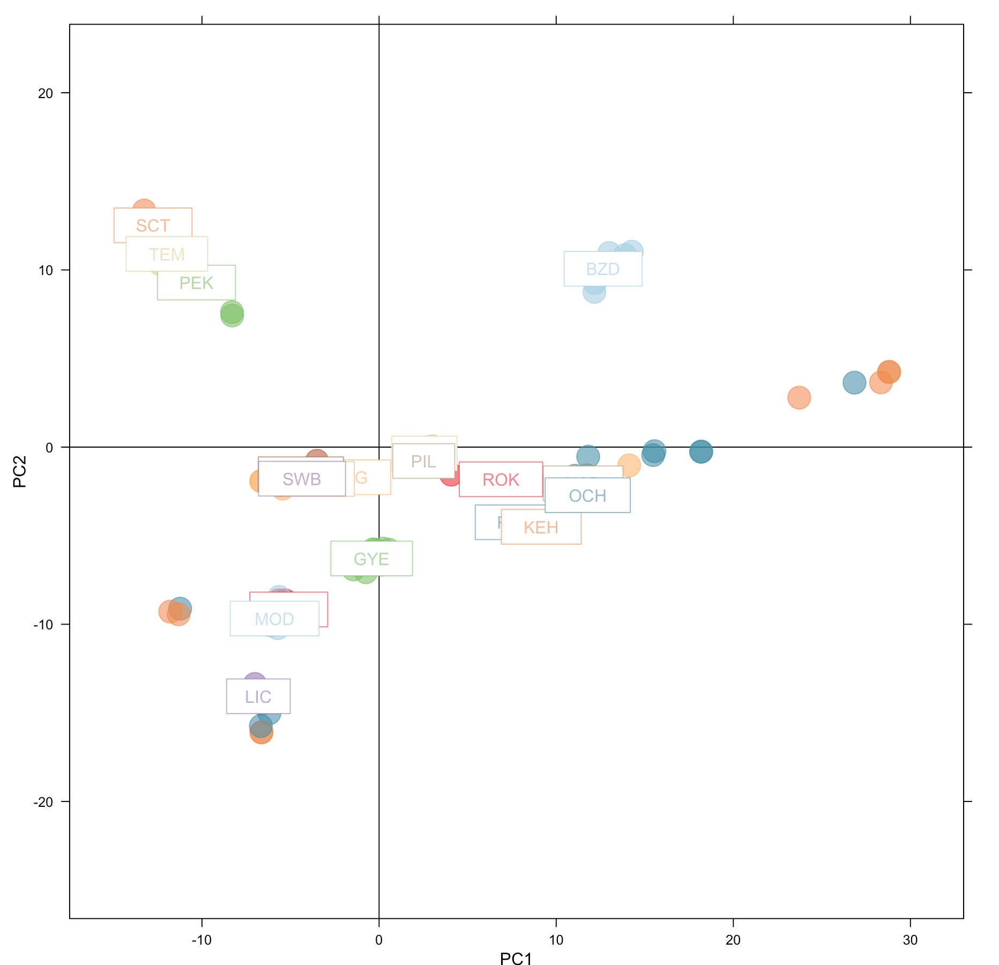

Again PC1 seperates pure lyrata (left) from hybrids (centre) and populations closer to arenosa (right) and PC2 is potentially seperating populations via geography.

#### To test if PC2 is seperating populations you can use the leaflet() package:
```
mymap <- leaflet() %>%
  setView(lng = 15.2551, lat = 50, zoom = 5) %>%
  addTiles()

mymap <- mymap %>% addMarkers(lng = 14.722019, lat = 50.533611, popup = "BZD")
mymap <- mymap %>% addMarkers(lng = 10.582812, lat = 51.583498, popup = "SCT")
mymap <- mymap %>% addMarkers(lng = 16.248345, lat = 49.090359, popup = "TEM")
mymap <- mymap %>% addMarkers(lng = 14.482233, lat = 50.116151, popup = "PEK")
mymap <- mymap %>% addMarkers(lng = 15.611308, lat = 47.876394, popup = "OCH")
mymap <- mymap %>% addMarkers(lng = 17.285185, lat = 46.773573, popup = "GYE")
mymap <- mymap %>% addMarkers(lng = 16.038565, lat = 47.780388, popup = "JOH")
mymap <- mymap %>% addMarkers(lng = 15.426401, lat = 48.294661, popup = "KAG")
mymap <- mymap %>% addMarkers(lng = 16.269984, lat = 48.092981, popup = "LIC")
mymap <- mymap %>% addMarkers(lng = 15.552699, lat = 48.396128, popup = "LOI")
mymap <- mymap %>% addMarkers(lng = 15.560472, lat = 48.381430, popup = "MAU")
mymap <- mymap %>% addMarkers(lng = 16.267199, lat = 48.079485, popup = "MOD")
mymap <- mymap %>% addMarkers(lng = 15.349241, lat = 48.239088, popup = "PIL")
mymap <- mymap %>% addMarkers(lng = 15.475190, lat = 48.389408, popup = "SCB")
mymap <- mymap %>% addMarkers(lng = 15.475190, lat = 48.389408, popup = "SWB")
mymap <- mymap %>% addMarkers(lng = 15.698451, lat = 47.937742, popup = "HAB")
mymap <- mymap %>% addMarkers(lng = 15.475190, lat = 48.389408, popup = "ROK")
mymap <- mymap %>% addMarkers(lng = 15.475190, lat = 48.389408, popup = "FRE")
mymap <- mymap %>% addMarkers(lng = 15.542146, lat = 47.816197, popup = "KEH")

mymap
```
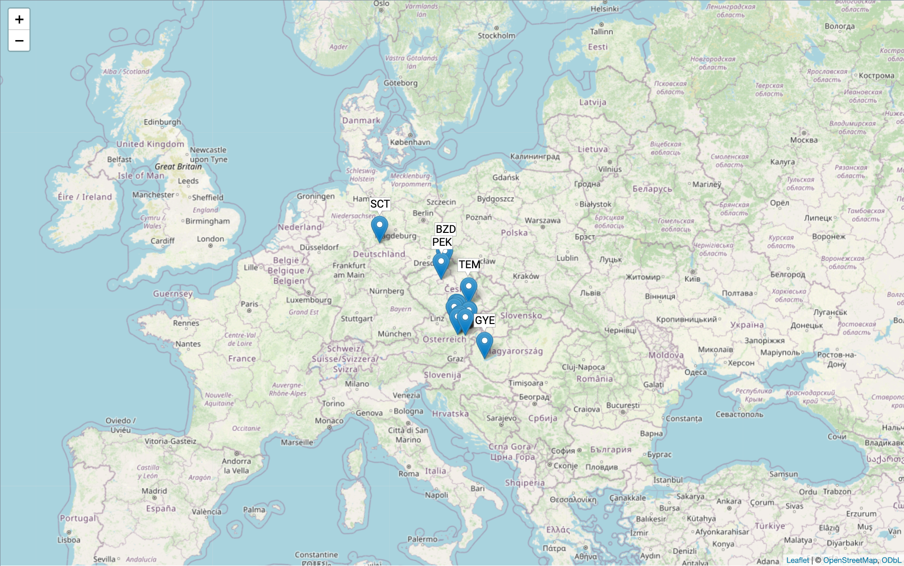
I have annotated the populations that were sampled outside the main cluster i.e. SCT, BZD, PEK, TEM and GYE. On the PCA SCT plots most positvely with PC2 and was sampled the furtherst North, similar with BZD, TEM and PEK. GYE is further South from the sample cluster, however, it doesn't have the most negative correlation with PC2 (this is LIC, MOD and JOH). Therefore, the relationship which PC2 describes is not fully clear.

#### For further analysis you can plot the PCA by individuals:
```
df <- extract.gt(vcf)
df[df == "0|0"] <- 0
df[df == "0|1"] <- 1
df[df == "1|0"] <- 1
df[df == "1|1"] <- 2
df[df == "0/0"] <- 0
df[df == "0/1"] <- 1
df[df == "1/0"] <- 1
df[df == "1/1"] <- 2
df[df == "0/0/0/0"] <- 0
df[df == "0/0/0/1"] <- 1
df[df == "0/0/1/1"] <- 2
df[df == "0/1/1/1"] <- 3
df[df == "1/1/1/1"] <- 4
df[df == "0/0/0/0/0/0"] <- 0
df[df == "0/0/0/0/0/1"] <- 1
df[df == "0/0/0/0/1/1"] <- 2
df[df == "0/0/0/1/1/1"] <- 3
df[df == "0/0/1/1/1/1"] <- 4
df[df == "0/1/1/1/1/1"] <- 5
df[df == "1/1/1/1/1/1"] <- 6
df <- data.frame(apply(df,2,function(x)as.numeric(as.character(x))))
```
Remove samples with > 50% missing data
```
mis <- apply(df,2,function(x)sum(is.na(x))/length(x))
df <- df[,mis <= 0.5]
```
Calculate allele frequencies
```
ploidy <- apply(df,2,max,na.rm=T)
p <- apply(df,1,function(x)sum(x,na.rm=T)/sum(ploidy[!is.na(x)]))
```
Removing individuals can change allele frequencies, so we make sure that maf >= 0.05
```
df <- df[p >= 0.05 & p <= 0.95,]
p <- p[p >= 0.05 & p <= 0.95]
```
Estimate a covariance matrix
```
n <- ncol(df)
cov <- matrix(nrow=n,ncol=n)
for(i in 1:n){
  for(j in 1:i){
    x <- mean(c(ploidy[i],ploidy[j]))
    cov[i,j] <- mean((df[,i]-x*p)*(df[,j]-x*p)/(x*p*(1-p)),na.rm=T)
    cov[j,i] <- cov[i,j]
  }	
}
```
Do PCA on the matrix
```
pc <- prcomp(cov,scale=T)
xlab <- paste0("PC1 (",round(summary(pc)$importance[2]*100),"%)")
ylab <- paste0("PC2 (",round(summary(pc)$importance[5]*100),"%)")
pcs <- data.frame(PC1=pc$x[,1],PC2=pc$x[,2],id=colnames(df),ploidy=ploidy)
```
Plot:
```
ggplot(pcs, aes(PC1, PC2, color=as.factor(ploidy))) +
  geom_point(size=7) +
  labs(x=xlab, y=ylab, color="Ploidy") +
  geom_text_repel(aes(label=id), size=4, force=20, color="black", max.overlaps = 100) +
  theme(panel.background = element_blank(),
        panel.grid.major=element_blank(), 
        panel.grid.minor=element_blank(), 
        panel.border=element_blank(),
        axis.line=element_line(color="black", linewidth=0.5),
        axis.text=element_text(size=11,color="black"),
        axis.ticks.length=unit(.15, "cm"),
        axis.ticks=element_line(color="black", linewidth=0.5),
        axis.title=element_text(size=12, color="black"),
        plot.title=element_text(size=14, color="black", hjust = 0.5),
        legend.text=element_text(size=11, color="black"),
        legend.title=element_text(size=12, color="black"),
        legend.key=element_blank(),
        aspect.ratio=1)
```
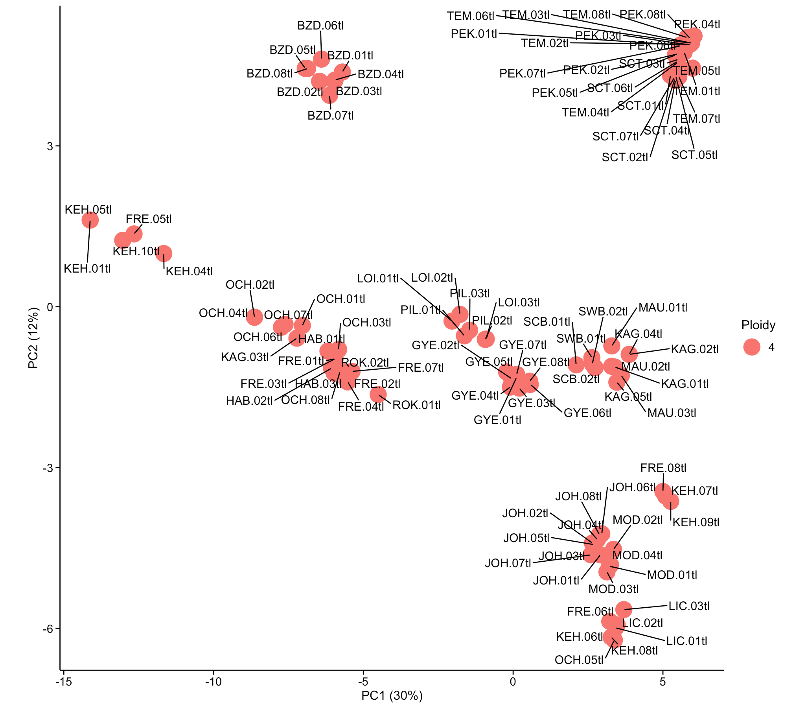

#### Filter out impure individuals
From observation alone it is clear to see that some individuals are plotting incorrectly. Individuals such as KAG.03tl plot close to the arenosa end of the scale which is incorrect as we know its pure lyrata. The below figure shows the other tainted individuals:

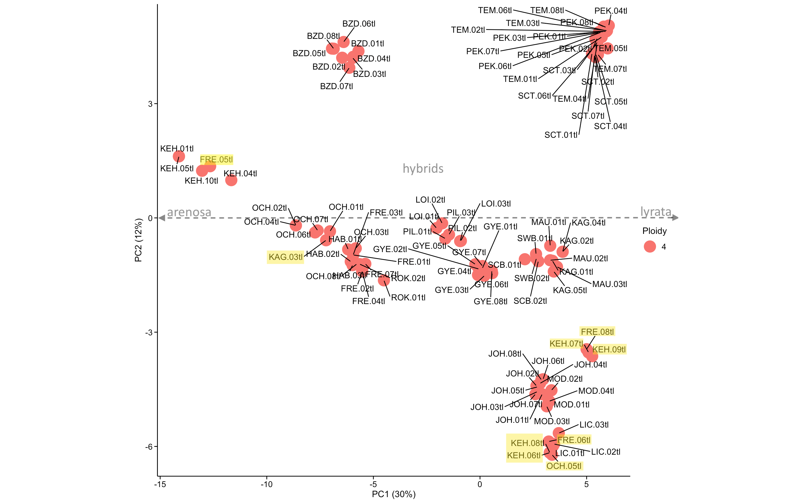

Returning to gatk, filter out the impure individuals:
# why impure!
```
grep -o -E 'BZD-....|PEK-....|SCT-....|TEM-....|GYE-....|JOH-....|KAG-(01|02|04|05|06|07|08)..|LIC-....|LOI-....|MAU-....|MOD-....|PIL-....|SCB-....|SWB-....|HAB-....|ROK-....|FRE-(01|02|03|04|05|07)tl|OCH-(01|02|03|04|06|07|08)tl|KEH-(01|02|03|04|05)tl' Chrom_1_noSnakemake.lyrata.bipassed.dp.m.bt.1pct.ld_pruned.vcf > filtered_tetraploid.args
```
Filter the vcf:
```
gatk SelectVariants -R [name_of_your_reference_file].fasta -V [name_of_your_vcf].vcf -sn filtered_tetraploid.args -O filtered_tetraploid.vcf 
```
Download and read the vcf into local pc:
```
vcf <- read.vcfR("filtered_tetraploids.vcf")
```
Run PCA:
```
df <- extract.gt(vcf)
df[df == "0|0"] <- 0
df[df == "0|1"] <- 1
df[df == "1|0"] <- 1
df[df == "1|1"] <- 2
df[df == "0/0"] <- 0
df[df == "0/1"] <- 1
df[df == "1/0"] <- 1
df[df == "1/1"] <- 2
df[df == "0/0/0/0"] <- 0
df[df == "0/0/0/1"] <- 1
df[df == "0/0/1/1"] <- 2
df[df == "0/1/1/1"] <- 3
df[df == "1/1/1/1"] <- 4
df[df == "0/0/0/0/0/0"] <- 0
df[df == "0/0/0/0/0/1"] <- 1
df[df == "0/0/0/0/1/1"] <- 2
df[df == "0/0/0/1/1/1"] <- 3
df[df == "0/0/1/1/1/1"] <- 4
df[df == "0/1/1/1/1/1"] <- 5
df[df == "1/1/1/1/1/1"] <- 6
df <- data.frame(apply(df,2,function(x)as.numeric(as.character(x))))
```
Remove samples with > 50% missing data
```
mis <- apply(df,2,function(x)sum(is.na(x))/length(x))
df <- df[,mis <= 0.5]
```
Calculate allele frequencies
```
ploidy <- apply(df,2,max,na.rm=T)
p <- apply(df,1,function(x)sum(x,na.rm=T)/sum(ploidy[!is.na(x)]))
```
Removing individuals can change allele frequencies, so we make sure that maf >= 0.05
```
df <- df[p >= 0.05 & p <= 0.95,]
p <- p[p >= 0.05 & p <= 0.95]
```
Estimate a covariance matrix
```
n <- ncol(df)
cov <- matrix(nrow=n,ncol=n)
for(i in 1:n){
  for(j in 1:i){
    x <- mean(c(ploidy[i],ploidy[j]))
    cov[i,j] <- mean((df[,i]-x*p)*(df[,j]-x*p)/(x*p*(1-p)),na.rm=T)
    cov[j,i] <- cov[i,j]
  }	
}
```
Do PCA on the matrix
```
pc <- prcomp(cov,scale=T)
xlab <- paste0("PC1 (",round(summary(pc)$importance[2]*100),"%)")
ylab <- paste0("PC2 (",round(summary(pc)$importance[5]*100),"%)")
pcs <- data.frame(PC1=pc$x[,1],PC2=pc$x[,2],id=colnames(df),ploidy=ploidy)
```
Plot:
```
ggplot(pcs, aes(PC1, PC2, color=as.factor(ploidy))) +
  geom_point(size=7) +
  labs(x=xlab, y=ylab, color="Ploidy") +
  geom_text_repel(aes(label=id), size=4, force=20, color="black", max.overlaps = 100) +
  theme(panel.background = element_blank(),
        panel.grid.major=element_blank(), 
        panel.grid.minor=element_blank(), 
        panel.border=element_blank(),
        axis.line=element_line(color="black", linewidth=0.5),
        axis.text=element_text(size=11,color="black"),
        axis.ticks.length=unit(.15, "cm"),
        axis.ticks=element_line(color="black", linewidth=0.5),
        axis.title=element_text(size=12, color="black"),
        plot.title=element_text(size=14, color="black", hjust = 0.5),
        legend.text=element_text(size=11, color="black"),
        legend.title=element_text(size=12, color="black"),
        legend.key=element_blank(),
        aspect.ratio=1)
```
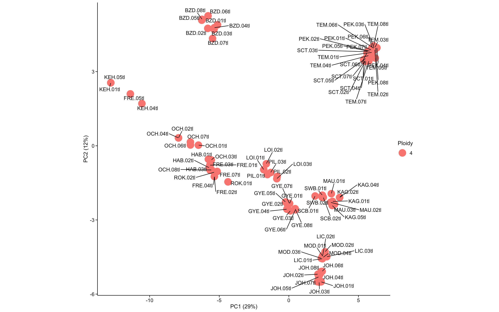

It is known that PC1 splits inidividuals closest to arenosa (left), hybrids (central) and pure lyrata (right), however it is slightly unclear what PC2 annotates. For example, why does BZD cluster on its own?

## Calculate Nei's distances
Create a matrix of pairwise distances for **individuals**:
```
aa.D.ind <- stamppNeisD(aa.genlight, pop = FALSE)
```
Export matrix - for SplitsTree
```
stamppPhylip(aa.D.ind, file="aa.indiv_Neis_distance_4ds.phy.dst")
```
Create a matrix of pairwise distances for **populations**:
```
aa.D.pop <- stamppNeisD(aa.genlight, pop = TRUE)
```
Export matrix - for SplitsTree
```
stamppPhylip(aa.D.pop, file="aa.pops_Neis_distance_4ds.phy.dst") 
```
Create the dist objects:
```
colnames(aa.D.ind) <- rownames(aa.D.ind)
aa.D.ind.dist <-as.dist(aa.D.ind, diag=T)
attr(aa.D.ind.dist, "Labels") <-rownames(aa.D.ind)

colnames(aa.D.pop) <- rownames(aa.D.pop) 
aa.D.pop.dist <-as.dist(aa.D.pop, diag=T)
attr(aa.D.pop.dist, "Labels") <-rownames(aa.D.pop)
```
Plot and save NJ tree
```
plot(nj(aa.D.ind), typ="unrooted", cex=0.7)
title(expression("Neighbour-joining tree of distance-based analysis of "*italic(Arabidposis)*" "))
write.tree(nj(aa.D.ind),file="NJ.distance_tree_outgroups.tre")
```
The plot of the NJ tree is hard to read:
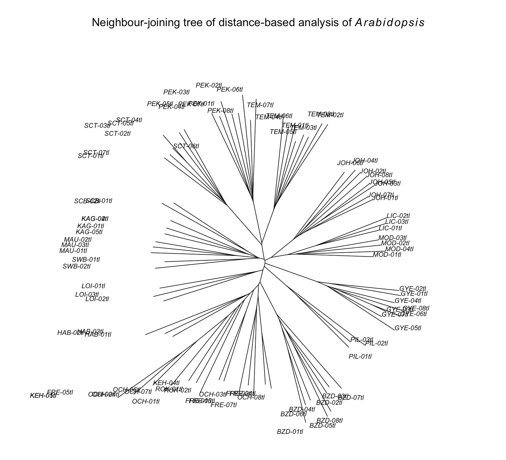

## SplitsTree

upload your .tre file to the SplitsTree software which you can downlaod here: https://software-ab.cs.uni-tuebingen.de/download/splitstree6/welcome.html

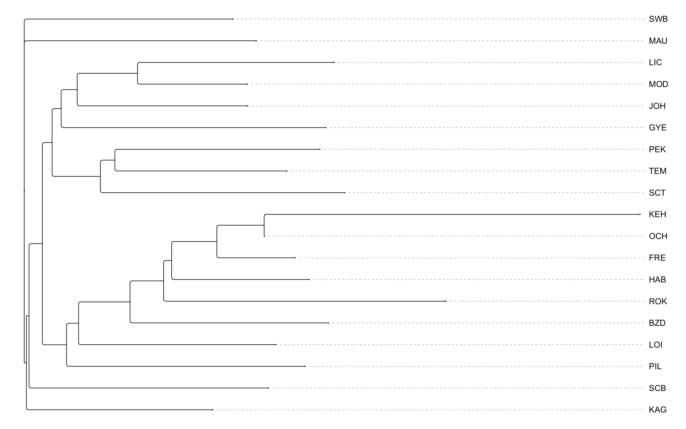

## fastSTRUCTURE
#### In a UNIX environment:

Download the Cochlearia_create_structure_file.py script, make the 5kbthin_MAF2pct/ directory with the mkdir command, ensure you move the vcf file you want the script to run on into this directory. This will convert polyploids data to a format acceptable to fastSTRUCTURE.

Now run:
```
python3 Cochlearia_create_structure_file.py -v 5kbthin_MAF2pct/ -o 5kbthin_MAF2pct -s true
```
This creates two files: '5kbthin_MAF2pct.StructureInpu.str' and '5kbthin_MAF2pct.StructureInputDiploidized.str' in a directory called 'vcf_to_str'

Now remove the first and last lines of the file so that fastSTRUCTURE can run:
```
sed '1d;$d' 5kbthin_MAF2pct.StructureInputDiploidized.str > diploidized_filtered_tetraploids.str
```
Upload to HPC or environment which contains fastSTRUCTURE:
```
scp diploidized_filtered_tetraploids.str [username]@[HPC_ip_address]:~/
```
Activate your fastSTRUCTURE environment if this is your choice of methodology:
```
conda activate /shared/conda/faststructure
```
Run the fast structure command, this requires the structure.py script. Ensure that your input file doesn't have the '.str' file extension as the script handles this.
```
python2 /[pathway_to_file]/structure.py -K 1 --input=/[pathway_to_file]/diploidized_filtered_tetraploids --output=[output_directory_name]/diploidized_filtered_tetraploids --format=str --full
python2 /[pathway_to_file]/structure.py -K 2 --input=/[pathway_to_file]/diploidized_filtered_tetraploids --output=[output_directory_name]/diploidized_filtered_tetraploids --format=str --full
python2 /[pathway_to_file]/structure.py -K 3 --input=/[pathway_to_file]/diploidized_filtered_tetraploids --output=[output_directory_name]/diploidized_filtered_tetraploids --format=str --full
python2 /[pathway_to_file]/structure.py -K 4 --input=/[pathway_to_file]/diploidized_filtered_tetraploids --output=[output_directory_name]/diploidized_filtered_tetraploids --format=str --full
python2 /[pathway_to_file]/structure.py -K 5 --input=/[pathway_to_file]/diploidized_filtered_tetraploids --output=[output_directory_name]/diploidized_filtered_tetraploids --format=str --full
python2 /[pathway_to_file]/structure.py -K 6 --input=/[pathway_to_file]/diploidized_filtered_tetraploids --output=[output_directory_name]/diploidized_filtered_tetraploids --format=str --full
python2 /[pathway_to_file]/structure.py -K 7 --input=/[pathway_to_file]/diploidized_filtered_tetraploids --output=[output_directory_name]/diploidized_filtered_tetraploids --format=str --full
python2 /[pathway_to_file]/structure.py -K 8 --input=/[pathway_to_file]/diploidized_filtered_tetraploids --output=[output_directory_name]/diploidized_filtered_tetraploids --format=str --full
python2 /[pathway_to_file]/structure.py -K 9 --input=/[pathway_to_file]/diploidized_filtered_tetraploids --output=[output_directory_name]/diploidized_filtered_tetraploids --format=str --full
python2 /[pathway_to_file]/structure.py -K 10 --input=/[pathway_to_file]/diploidized_filtered_tetraploids --output=[output_directory_name]/diploidized_filtered_tetraploids --format=str --full
```
Run the following command to discover the best value of k
```
python2 /shared/conda/faststructure/bin/chooseK.py --input=diploidized_filtered_tetraploids
```
The return I recieved:
**Model complexity that maximizes marginal likelihood = 1**

**Model components used to explain structure in data = 2**

Now create an output file to visualise the results:
```
paste -d '\t' pops.txt diploidized_filtered_tetraploids.3.meanQ > structure_plot.tsv
cat structure_plot.tsv | tr '\t' ',' | tr -s '[:blank:]' ',' > structure_plot.csv
```

#### In Structure Plot V2.0:
Upload your csv and select the K value you used. Plot by 'Ind Labels' which plots by population??

## histograms
#### First create a synthetic allotetraploid
We know from previous research by Yant et al. that allo**hexaploids** plot on a histogram like such:
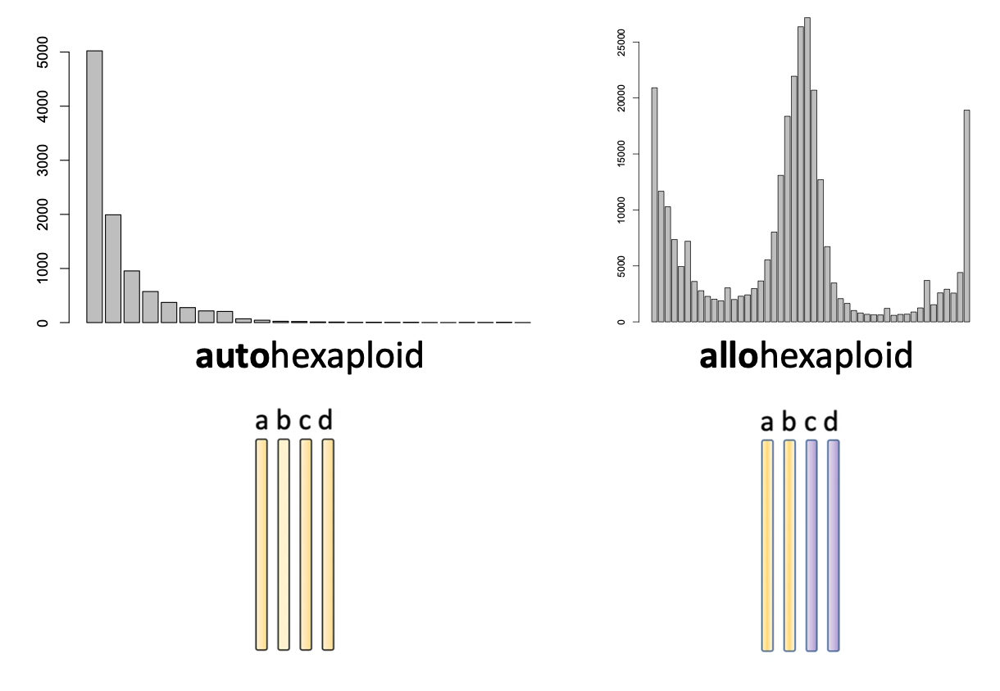
**Autohexaploids** plot right skewed, as the most frequent allele frequency (plotted on the x-axis) are the close to 0 frequecnies as theses are the random SNPs. **Allohexaploids** plot with a central spike as ...

However these are hexaploids and the sames we are looking at are tetraploids. To avoid potential overlooking of data, it is best to create a synthetic allotetraploid to compare the sample data with.

Using the files 'arenosa_632.txt' and 'lyrata_272_with_some_hybrids.txt' which contain mostly tetraploid data of arenosa and lyrata samples:

Read the data in:
```
arenosa_632 <- read.table(file ='arenosa_632.txt' ,header = TRUE,sep = '\t')
lyrata_272 <- read.table(file ='lyrata_272_with_some_hybrids.txt' ,header = TRUE,sep = '\t')
```
Merge the two data frames based on the 'POS' column:
```
merged_df <- merge(arenosa_632, lyrata_272, by = "POS", suffixes = c("_arenosa", "_lyrata"))
```
Calculate the mean of the 'AF' column for matching rows:
```
merged_df$Mean_AF <- (merged_df$AF_arenosa + merged_df$AF_lyrata) / 2
```
Create a new data frame with 'POS' and 'Mean_AF':
```
new_df <- merged_df[, c("POS", "Mean_AF")]
```
After plotting, the uncommon SNPs mask potential trends in the data, so filter by mean allele frequency greater than 0.1:
```
filtered_df <- new_df[new_df$Mean_AF > 0.1, ]
```
Now plot:
```
ggplot(data = filtered_df, aes(Mean_AF)) +
  geom_histogram(color='black',fill='white', bins = 100)
```
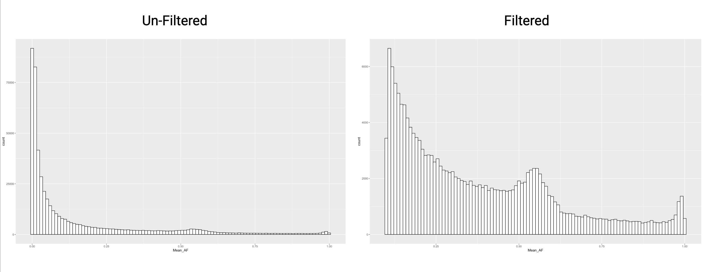


#### In R - create a pops.txt file:
```
individual_names <- indNames(aa.genlight)
populations <- as.character(pop(aa.genlight))
data <- data.frame(individual_names, populations)
write.table(data, "pops.txt", sep = "\t", row.names = FALSE, col.names = FALSE)
```
This will create a tab deliminated file with the individual name and their population

#### In a Unix environment:
```
sed 's/"//g' pops.txt > output.txt   #removes all the ""
gcc poly_freq.c -o poly_freq -lm
 ./poly_freq -vcf [title_of_your_vcf].vcf -pops pops.txt > info.tsv
```
This will create a file with population-specific allele frequencies
n.b. poly_freq.c script is required here (the script contains set up information)

#### Read in the tsv. in R you should have piped the output from poly freq to a 'file.tsv' 
```
df <- read.table(file ='info.tsv' ,header = TRUE,sep = '\t')
```
#### Store allele frequencies of the population you want to plot in a variable
```
allele_frequencies <- df$BZD
```
#### plot a histogram of the results
```
ggplot(data=df, aes(x=allele_frequencies)) + geom_histogram(color='black',fill='white')
```
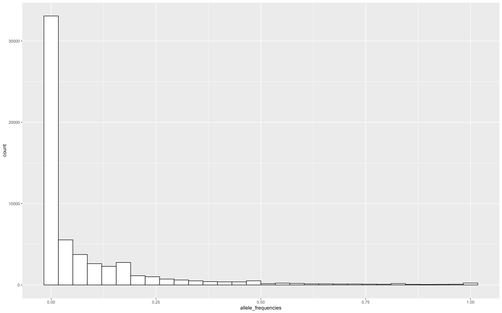

