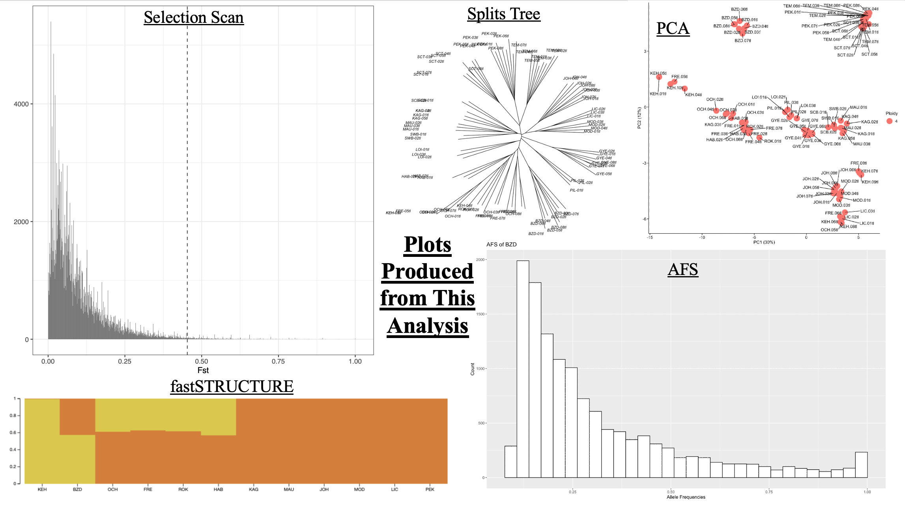
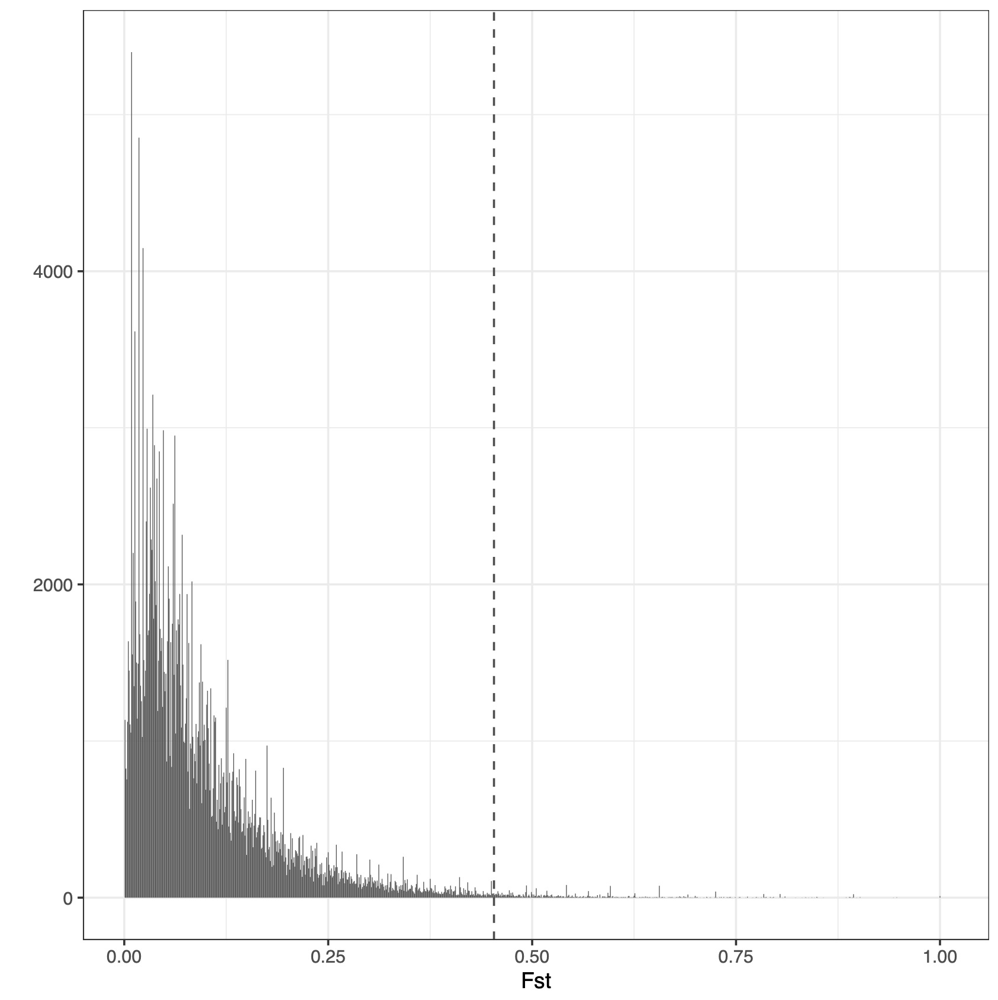

# LIFE4136 Rotation 3
Welcome to the GitHub repository dedicated to Rotation 3 of LIFE4136, where we delve into the intriguing realm of allopolyploidy following whole-genome duplication (WGD). Building upon the groundwork laid by Marburger et al. in 2019 (accessible via this link: https://www.nature.com/articles/s41467-019-13159-5), this platform houses an exploration of discernible patterns indicating the presence of allopolyploidy within hybrid populations.

Our research aims to provide insights crucial to the ongoing investigations led by the Marbuger et al. team, unravelling the mechanisms and significance of allopolyploidy arising from interspecific hybridization post-WGD.

Arabidopsis arenosa (referred to as 'arenosa' henceforth) stands as the sister species to Arabidopsis lyrata ('lyrata' henceforth). Both species manifest in diploid and tetraploid forms, with arenosa preceding lyrata in undergoing WGD. The post-WGD hybridization of lyrata with arenosa tetraploids, though occurring subsequently, introduces a degree of instability due to the infusion of novel genetic elements. Those hybrids that retain sub-genomes reminiscent of their parent species are recognized as allopolyploids.

Anticipated is the gradual reduction of allotetraploids to a diploid state over time, thus fostering increased genetic diversity within the Arabidopsis taxa.

The data that this project is comprised of are diploid and tetraploid in nature. Some of the populations are novel to this project (i.e. were collected after 2019) and as such their allo/auto-polyploidy status is unknown. Through various methods such as Principle Component Analysis (PCA), Relatedness Calculations, Structure Plotting and Allele Frequency Spectrums it is expected that the populations will consist of a variety of arenosa and or lyrata genomes. If a population is a hybrid of the sister species it may not necessarily be allopolyploid.  

## Contents
- [1. Dependencies](#dependencies)
- [2. Files Required](#files_required)
- [3. Initial Visualisation of Data](#initial_visualisation_of_data)
  - [3.1 Converting a VCF into a genlight object](#vcf_to_genlight)
  - [3.2 Sense checking data](#sense_check)
  - [3.3 Running an initial PCA](#initial_pca)
- [4. Filtering Data for Further Analysis of Trends](#filter_data_for_further_analysis_of_trends)
  - [4.1 Filtering with GATK](#gatk)
  - [4.2 Re-running the PCA](#second_pca)
  - [4.3 Testing geographical influence](#map)
  - [4.4 Running a PCA on individuals in a population](#third_pca)
  - [4.5 Further filtering with GATK](#further_gatk)
- [5. Relatedness Calculations](#relatedness_calculations)
  - [5.1 Nei's distances](#nei)
  - [5.2 SplitsTree](#splitstree)
- [6. Fast Structure](#fast_structure)
- [7. Allele Frequency Spectrum](#allele_frequency_spectrum)
  - [7.1 Creating an example allotetraploid](#allotetraploid)
  - [7.2 Creating allele frequency histograms](#histogram)
- [8. Selection Scan](#selection_scan) 
- [9. Acknowledgements](#acknowledgements) 



## 1. Dependencies

<a name="dependencies"/>

* To run *Principle Component Analysis*, *Sample Mapping*, *Nei's Distance Calculations* and *Allele Frequency Spectrum Plots* **R Studio version 4.3.3** is needed, this can be downloaded here: https://cran.r-project.org/mirrors.html, simply navigate to your country and select the package compatible for your machine. Secondary to this, the following R packages need to be installed for the code to run:
  * **adegenet** version 2.1.10 or higher, simply install by typing: ```install.pacakges(adegenet)``` into the R command line
  * **adegraphics** version 1.0.21 or higher, simply install by typing: ```install.packages(adegraphics)``` into the R command line
  * **dplyr** version 1.1.4 or higher, simply install by typing: ```install.packages(dplyr)``` into the R command line
  * **ggplot2** version 3.4.4 or higher, simply install by typing: ```install.packages(ggplot2)``` into the R command line
  * **ggrepel** version 0.9.5 or higher, simply install by typing: ```install.packages(ggrepel)``` into the R command line
  * **leaflet** version 2.2.1 or higher, simply install by typing: ```install.packages(leaflet)``` into the R command line
  * **StAMPP** version 1.6.3 or higher, simply install by typing: ```install.packages(StAMPP)``` into the R command line
  * **tidyr** version 1.3.0 or higher, simply install by typing: ```install.packages(tidyr)``` into the R command line
  * **vcfR** version 1.15.0 or higher, simply install by typing: ```install.pacakges(vcfR)``` into the R command line
* To run *gatk*, **version 4.2.2.0** is required, first create a virtual environment, for example ```conda create --name /shared/apps/conda/bio2```, change the name and location accordingly. Then download the package: https://github.com/broadinstitute/gatk/releases, and follow installation instructions. Other dependencies are:
  * **Conda version 23.11.0** which can be downloaded here: https://conda.io/projects/conda/en/latest/user-guide/install/index.html simply choose your device type (Mac, Windows or LINUX), choose the miniconda installer as this is free and will suffice for this project, download the installer, verify your installer with hashers (more information on how to do this for your specific device type are on the website) and download the package.
  * **Python version 3.8.12** your device may already have python installed, to check type ```python3 version``` in a command prompt (windows) or terminal (mac), if not download it here: https://www.python.org/downloads/release/python-3123/
  * **SAMtools version 1.19.2** which can be downloaded here: https://www.htslib.org/download/
* To plot the *Neighbour Joining (NJ) Trees* **Splits tree of version 6.2.2-beta** is required which can be downloaded at: https://github.com/husonlab/splitstree6
* To run the scripts for *fastStructure* **Python version 2.7.18** is required, to enable the use of this, create a virtual environment: ```conda create -y -n /shared/conda/faststructure python=2.7.18``` change the name and location accordingly. Other dependencies are:
  * **faststructure** version 0.0.0, which can be cloned here: git clone https://github.com/rajanil/fastStructure
  * **scipy** version 1.2.1, which can be installed in a python 2 environment by: ```pip install scipy```
  * **numpy** version 1.16.5, which can be installed in a python 2 environment by: ```pip install numpy```
  * **utils** version 0.9.0, which can be installed in a python 2 environment by: ```pip install utils```
  * **Structure Plot** version 2.0, which can be accessed here: http://omicsspeaks.com/strplot2/
* To produce *selection scans* create a virtual environment: ```conda create -y -n selection_scan_environment python=3.7``` and install the following packages:
  * **R version 4.2**, install by typing ```conda install -c conda-forge r-base=4.2``` into the command line
  * **ggplt2**, install by typing ```conda install r-ggplot2=3.3.6``` into the command line
  * **bedtools**, install by typing ```conda install -c bioconda bedtools -y``` into the command line
  * **gatk4**, install by typing ```conda install -c bioconda gatk4 -y``` into the command line
  * **natsort**, install by typing ```pip install natsort``` into the command line
  * **pandas**, install by typing ```pip install pandas``` into the command line
  * **matplotlib**, install by typing ```pip install matplotlib``` into the command line
  * **numpy**, install by typing ```pip install numpy``` into the command line
  * **scipy**, install by typing ```pip install scipy``` into the command line

## 2. Files Required

<a name="files_required"></a>

* A **vcf** with all your samples, in this repository it is called 'Chrom_1_noSnakemake.lyrata.bipassed.dp.m.bt.1pct.ld_pruned.vcf'
* A reference **fasta file** to which your reads were aligned to, in this repository it is called 'lyrata.fasta'

## 3. Initial Visualisation of Data

<a name="initial_visualisation_of_data"></a>

Load packages in R:
```
library(vcfR)
library(adegenet)
library(adegraphics)
library(tidyr)
library(dplyr)
library(ggplot2)
library(ggrepel)
library(StAMPP)
library(leaflet)
```
Set working directory:
```
setwd("[path_to_working_directory]")
```
Read in vcf:
```
vcf <- read.vcfR("[title_of_vcf].vcf")
```

### 3.1 Convert your VCF into a Genlight Object

<a name="#vcf_to_genlight"></a>

Convert your vcf into a genlight object using the **create_genlight_object.R** script (to execute an R script simply open it in the console window and click [Run]).

### 3.2 Check your data - this section is optional:

<a name="sense_check"></a>

```
aa.genlight
```
This will tell you basic information about your genlight object, for example, how many individuals in sample.

If you want to see the individual names: ```indNames(aa.genlight)```

If you want to see the populations and number of them, run: ```unique(pop(aa.genlight))```

If you want to see the variety of ploidy, run: ```unique(ploidy(aa.genlight))```

### 3.3 Run an initial PCA:

<a name="initial_pca"></a>

This will allow for the discovery of potential trends in your data and allow for preliminary visualisation, instructions are in the **PCA.R** script.

This is what my first PCA looked like:


For reference, this figure from the Marburger paper, *linked at the top of the page,* shows some information on ploidy and purity of the new data (not all populations are included in this plot and SWA and HAL are SWB and HAB in the new data respectively):


At first it is difficult to see trends.

Try colouring by ploidy:
```
ploidy_labels <- factor(ploidy(aa.genlight))
s.class(pca.1$scores, ploidy_labels, xax=1, yax=2, col=transp(col,.6), ellipseSize=0, starSize=0, ppoints.cex=4, paxes.draw=T, pgrid.draw =F, xlab = "PC1", ylab = "PC2")
```


As you can see PC1 seems to relatively separate diploids and tetraploids and PC2 hybrids from pure lyrata. However, this isn't a perfect pattern, many diploids cluster positively with PC1 (with the tetraploids). Furthermore, the tetraploids include hybrids (a mixture of lyrata and arenosa) and a population genetically similar to arenosa (KEH). In the diploid population there are only pure lyrata, this means that the PCA could be unbalanced as there are no arenosa diploids to balance out the arenosa tetraploids.

## 4. Filter Data for Further Analysis of Trends

<a name="filter_data_for_further_analysis_of_trends"></a>

### 4.1 Filter your vcf with gatk:

<a name="gatk"></a>

Run the **filter_vcf.sh** script by typing ```./filter_vcf.sh``` if the script is in the directory you are currently in. This also requires the **retrieve_IDs_updated_FIX.py** script (located in the same directory). Change the vcf in line 10,23 and 28 to your vcfs name, you can also change the populations on line 11 to those you require and on lines 17,20 and 27 change the reference fasta file to the one that matches your data. 

At this stage, the diploids were removed from our dataset.

### 4.2 Re-run the PCA:

<a name="second_pca"></a>

In R, read in the vcf. The vcf created from the filter_vcf.sh script is called 'tetraploid.vcf', to change this edit line 30.
```
vcf <- read.vcfR("tetraploid.vcf")
```
Convert to a genlight object using the function you have already defined from the **create_genlight_object.R** script:
```
aa.genlight <- vcfR2genlight.tetra(vcf)
locNames(aa.genlight) <- paste(vcf@fix[,1],vcf@fix[,2],sep="_")
pop(aa.genlight)<-substr(indNames(aa.genlight),1,3) 
```
Run a PCA (using the function you have already defined in **PCA.R** script) and plot:
```
pca.2 <- glPcaFast(aa.genlight, nf=300)
s.class(pca.2$scores, pop(aa.genlight), xax=1, yax=2, col=transp(col,.6), ellipseSize=0, starSize=0, ppoints.cex=4, paxes.draw=T, pgrid.draw =F, xlab = "PC1", ylab = "PC2")
```


Again PC1 separates pure lyrata (left) from hybrids (centre) and populations closer to arenosa (right) and PC2 is potentially separating populations via geography.

### 4.3 To test if PC2 is separating populations via geographical location you can use the leaflet() package:

<a name="map"></a>

```
mymap <- leaflet() %>%
  setView(lng = 15.2551, lat = 50, zoom = 5) %>%
  addTiles()

mymap <- mymap %>% addMarkers(lng = 14.722019, lat = 50.533611, popup = "BZD", label = "BZD",labelOptions = labelOptions(noHide = TRUE))
mymap <- mymap %>% addMarkers(lng = 10.582812, lat = 51.583498, popup = "SCT", label = "SCT",labelOptions = labelOptions(noHide = TRUE))
mymap <- mymap %>% addMarkers(lng = 16.248345, lat = 49.090359, popup = "TEM", label = "TEM",labelOptions = labelOptions(noHide = TRUE))
mymap <- mymap %>% addMarkers(lng = 14.482233, lat = 50.116151, popup = "PEK", label = "PEK",labelOptions = labelOptions(noHide = TRUE))
mymap <- mymap %>% addMarkers(lng = 15.611308, lat = 47.876394, popup = "OCH")
mymap <- mymap %>% addMarkers(lng = 17.285185, lat = 46.773573, popup = "GYE", label = "GYE",labelOptions = labelOptions(noHide = TRUE))
mymap <- mymap %>% addMarkers(lng = 16.038565, lat = 47.780388, popup = "JOH")
mymap <- mymap %>% addMarkers(lng = 15.426401, lat = 48.294661, popup = "KAG")
mymap <- mymap %>% addMarkers(lng = 16.269984, lat = 48.092981, popup = "LIC")
mymap <- mymap %>% addMarkers(lng = 15.552699, lat = 48.396128, popup = "LOI")
mymap <- mymap %>% addMarkers(lng = 15.560472, lat = 48.381430, popup = "MAU")
mymap <- mymap %>% addMarkers(lng = 16.267199, lat = 48.079485, popup = "MOD")
mymap <- mymap %>% addMarkers(lng = 15.349241, lat = 48.239088, popup = "PIL")
mymap <- mymap %>% addMarkers(lng = 15.393005, lat = 48.2742817, popup = "SCB")
mymap <- mymap %>% addMarkers(lng = 15.40084, lat = 48.3403, popup = "SWB")
mymap <- mymap %>% addMarkers(lng = 15.698451, lat = 47.937742, popup = "HAB")
mymap <- mymap %>% addMarkers(lng = 15.68304, lat = 47.9053, popup = "ROK")
mymap <- mymap %>% addMarkers(lng = 15.57118, lat = 47.99405, popup = "FRE")
mymap <- mymap %>% addMarkers(lng = 15.542146, lat = 47.816197, popup = "KEH")

mymap
```
SetView() is used to set the central coordinates of the map produced (the ones used in the above coordinates are central Europe) and the zoom is set to 5. Add in the latitude and longitude coordinates for your sample populations and their names. Coordinates for the data used in this study were obtained from the sample map provided, the specific coordinates were missing for BZD, SCT, TEM, PEK and GYE so they were estimated using the description of where they were sampled.


Using the labelOptions() function, the populations that were sampled outside the main cluster i.e. SCT, BZD, PEK, TEM and GYE were highlighted. On the PCA SCT plots most positively with PC2 and was sampled the furthest North, similar with BZD, TEM and PEK so this supports the hypothesis that PC2 separates the populations by geography. However, GYE is further South from the sample cluster, but it doesn't have the most negative correlation with PC2 (this is LIC, MOD and JOH). Therefore, the relationship which PC2 describes is not fully clear.

### 4.4 For further analysis you can plot the PCA by individuals:

<a name="third_pca"></a>

Run the **individuals_PCA.R** script.


### 4.5 Filter out impure individuals

<a name="further_gatk"></a>

From observation alone, it is clear to see that some individuals are plotting incorrectly. Individuals such as KAG.03tl plot close to the arenosa end of the scale (left) which is incorrect as we know from Marburger et al., it's pure lyrata. Impurity can occur due to many reasons, including incorrect labelling of samples, sample mix-ups in the lab, contamination etc. The below figure shows the other impure individuals, highlighted in yellow:


Re-run the **filter_vcf.sh** script (```./filter_vcf.sh```), changing the '-opre' flag on line 14 to 'filtered_tetraploid.args', adding the '-xcl' flag to line 15 followed by 'samples_to_exclude.args' which is a file provided at the top of the page consisting of the 9 impure individuals and finally change the '--output' flag on line 30 to 'filtered_tetraploids.vcf'.

Load this vcf into R (```vcf <- read.vcfR("filtered_tetraploids.vcf")```) and re-run the PCA using the **individuals_PCA.R** script


It is obvious by now that PC1 splits individuals closest to arenosa (left), hybrids (central) and pure lyrata (right), thus the populations which may be allopolyploids are BZD, OCH, FRE, ROK, HAB, LOI, PIL and GYE. It is still slightly unclear what PC2 annotates. For example, why does BZD cluster on its own? Investigating relatedness may clear this up.

## 5. Relatedness Calculations

<a name="relatedness_calculations"></a>

### 5.1 Calculate Nei's distances

<a name="nei"></a>

Run the **NEI.R** script which consists of code provided by Ana  C. da Silva. The script plots the data as individuals and saves a .tre file in their populations for plotting in SplitsTree later. You can alter this in the code where it says 'plot(nj(aa.**ind**)...' and 'write.tree(nj(aa.D.**pop**)' change 'ind' and 'pop' accordingly. It is useful to plot as individuals to see if there are still impure data or any occurrences which are different to what is expected.

The following plot is produced for the data I am using:


This tree is unrooted and follows the same trends as seen with the PCA and purity figure: LIC and MOD branch together as they are the purest lyrata, and share a recent common ancestor. JOH (one of the new populations) branches with these two and clusters with them on the PCA meaning it must be a pure lyrata. The SCT, PEK and TEM populations, which we first saw clustering separately on the PCA and then discovered a geographical similarity, branch as the same trio, showing a genetic likelihood. Other trends show and are easier to see when uploading to the SplitsTree software.

### 5.2 SplitsTree

<a name="splitstree"></a>

After downloading SplitsTree (instructions at the top of the page) upload your .tre file to the SplitsTree software by navigating to [File] and then [Open]. Once loaded select [Tree] and then [NJ] to view your tree as a midpoint rooted neighbour joined tree. The output should look as follows:


Interestingly, SWB and MAU are out grouped. From the Marburger et al., purity plot these individuals were annotated as approximate pure lyrata. These two populations likely diverged first after undergoing WGD and haven't hybridised. Interestingly the population closest to arenosa (KEH) is nested amongst the lineage, this supports the theory that these lyrata tetraploids hybridised post-WGD. The distance from KEH from its shared common ancestor with OCH is extensive, meaning the further acquisition of arenosa material occurred after divergence. The allopolyploids form a monophyletic group (KEH to PIL) every other population external to this (except GYE) is relatively pure lyrata.

## 6. FastStructure

<a name="fast_structure"></a>

Run the **faststructure_pipeline_final.sh** script using: (```./faststructure_pipeline_final.sh```). The **retrieve_IDs_updated_FIX.py**, **reorder_str_file.py** and **Cochlearia_create_structure_file.py** scripts are required here. Along with your reference fasta file, your vcf file and an .args files with a list of populations you want to exclude (an example called samples_to_exclude.args is included at the top of the page). This script produces the following:
* A filtered vcf with only specific populations
* VCFs for each population in the filtered vcf you created. This becomes useful later on when trying to find signatures of allopolyploidy
* A .str file which works with faststructure
* Runs faststructure on the data and produces csv files for K values 1-10 in a format acceptable by the structure plot website 

NOTE
If you want to change the populations used you will have to change the pops used in lines 57, 93 and 148

After running, download the csv files from the /final_omicsspeaks_output directory and upload them to structure plot: http://omicsspeaks.com/strplot2/


After preliminary testing, the populations SWB, GYE, TEM, SCT, LOI, PIL and SCB were removed as too many pure lyrata skewed the plot as there was only one pure arenosa in comparison. If you wish to adjust this change the populations on lines 57, 93 and 148. Some of the removed populations weren't fully pure lyrata however due to having a low percentage of arenosa genes, aren't likely to be allopolyploids. SCT and TEM were removed and was PEK kept as they are closely related so one population suffices to represent the others. This package is not fully reliable as the data had to be filtered slightly to produce a worthy plot.

The plot is at k = 2 because there are only two 'clusters' (arenosa and lyrata), with KEH (far left) plotting as almost full arenosa (expected from previous knowledge), BZD, OCH, FRE, ROK and HAB plotting as hybrids and the rest plotting as pure lyrata (expected). 

## 7. Allele Frequency Spectrum

<a name="allele_frequency_spectrum"></a>

Another way of investigating whether a population is an allopolyploid is by creating Allele Frequency Spectrums (AFS). Most commonly this is represented on a histogram. The output visualises the genetic variation within a population by describing the distribution of allele frequencies.

We know from previous research by Marburger et al. that allo- and auto- **hexaploids** plot on a histogram like such:

The **autohexaploids** plot with an exponential distribution which is right skewed, this is because the least frequent allele frequencies are the rarely occurring single nucleotide polymorphisms (SNPs). There are many different SNPs which occur close to a frequency of zero, causing this high left peak. **Allohexaploids** plot with a left, central and right peak. Again the data contains a high count of in-frequent SNPs which form the left peak. The central peak represents the alleles which occur at virtually half frequency because on average hybrids contain 50/50 alleles from the two populations that merged and thus the frequently occurring alleles in one population are only half in the new population. The right-sided peak is formed from alleles which are conserved over both populations.

Autopolyploids always follow this exponential distribution, where the increase in sets of chromosomes only broadens the allele frequency distribution. However, it is uncertain how a allo**tetraploid** would plot as the above histogram plots **hexaploid** data. To avoid potential overlooking of data and to draw reasonable comparisons, it is best to create an example allotetraploid to compare the sample data with.

### 7.1 Creating an example allotetraploid:

<a name="allotetraploid"></a>

Return to R studio and download the files 'arenosa_632.txt.gz' and 'lyrata_272_with_some_hybrids.txt' to the working directory you set earlier. First, the arenosa file will need to be unzipped, to do this you need to be in a UNIX environment with the gunzip command ```gunzip arenosa_632.txt.gz```. These files contain mostly tetraploid data of arenosa and lyrata samples which we can merge to create an allotetraploid. If you are using different populations locate files which contain at least allele frequencies at specific positions on chromosomes. Run the **synthetic_allotetraploid.R** script.


The filtered plot is set to allele frequency >0.1 to remove the skew created by SNPs. From the filtered plot it is clear to see there is still a central peak in allotetraploids it is just less defined than the allohexaploid plot (note this may be because of different sample or bin sizing). Now let's compare our data to this allotetraploid.

### 7.2 Creating allele frequency histograms

<a name="histogram"></a>

Execute the **allele_frequency_plots.R** script in R, which also requires the execution of the **poly_freq.c** script in a Unix environment (instructions in the R script), this was attained from Toumas Hämälä https://github.com/thamala/polySV. The following five plots are for the five hybrid populations which plotted as roughly half arenosa and half lyrata in the fast structure plot. These can be viewed separately in the Figures/ directory at the top of the page. Each of the histograms was plotted with a bin size according to the sample size and was again filtered for an allele frequency >0.1.


None of the populations seem to follow the same pattern as the example allotetraploid created above. There is a clear absence of a middle peak which is a conserved trait of allopolyploids. 

## 8. Selection Scans

<a name="selection_scan"></a>

From the fast structure pipeline, there was a directory created called 'individual_population_files/' within this, there are individual vcfs for each of the populations you determined earlier. From your home directory, create a new directory called 'selection_scan/' with the ```mkdir``` command and copy the files of the populations you want to run a selection scan on into this directory with the ```cp``` command. I used BZD_individuals.args.vcf and LIC_individuals.args.vcf to investigate the differences between the suspected allopolyploid (BZD) and a pure lyrata (LIC). Now download the scripts at the top of this repository in the 'Selection_Scan_Scripts/' directory and execute the selection_scan_pipeline.sh script (```./selection_scan_pipeline.sh```). To use different populations these need to be changed within the script. 

This will create allele count tables and various graphs. Such as the graph below which is an Fst histogram at 10,000ppm (parts per million) for the 2 populations LIC and BZD. The right-skewed distribution suggests that the majority of Fst values are lower, indicating moderate to low genetic differentiation between the populations. This could mean that most of the genetic variation is shared between the populations which is expected as they both consist of lyrata genome. The outliers close to Fst values of 1 indicate instances where genetic differentiation is very high or nearly complete. These outliers might represent loci or genomic regions that are highly diverged or under strong selective pressure in one or both populations.



After running this analysis on other suspected allopolyploids (HAB, OCH, FRE and ROK) it was discovered that three (BZD, HAB and OCH) had a gene called 'PHS1' which regulates recombination and pairing of homologous chromosomes during meiotic prophase. This was acquired from the various files with the syntax '2SNPs_10000ppm_ALL_0ol_GF.txt'. This gene is being selected for, so that gene flow and reproductive compatibility are improved between arenosa and lyrata hybrids. The stabilisation of hybrid genomes means the population has a possibility of forming a sub genome and thus being an allopolyploid. 

In conclusion, our data doesn't seem to definitely contain any allopolyploids however they are definitely in the process of forming. By collecting more data or studying populations which underwent WGD and subsequent interspecies hybridisation less recently there would be a greater chance of discovering allopolyploids and ensuing genome reduction.

## 9. Acknowledgements

<a name="acknowledgements"></a>

* **adegenet**
  * Jombart, T. (2008) adegenet: a R package for the multivariate analysis of genetic markers. Bioinformatics 24: 1403-1405. doi: 10.1093/bioinformatics/btn129
  * Jombart T. and Ahmed I. (2011) adegenet 1.3-1: new tools for the analysis of genome-wide SNP data. Bioinformatics. doi: 10.1093/bioinformatics/btr521
* **adegraphics**
  * Aurélie Siberchicot, Alice Julien-Laferrière, Anne-Béatrice Dufour, Jean Thioulouse and Stéphane Dray (2017). adegraphics: An S4 Lattice-Based Package for the Representation of Multivariate Data. The R Journal. 9:2. 198--212. https://journal.r-project.org/archive/2017/RJ-2017-042/index.html
  * Jean Thioulouse, Stéphane Dray, Anne-Béatrice Dufour, Aurélie Siberchicot, Thibaut Jombart and Sandrine Pavoine (2018). Multivariate Analysis of Ecological Data with ade4. Springer. https://doi.org/10.1007/978-1-4939-8850-1
* **bedtools**
  * Quinlan AR and Hall IM, 2010. BEDTools: a flexible suite of utilities for comparing genomic features. Bioinformatics. 26, 6, pp. 841–842.
* **dplyr**
  * Wickham H, François R, Henry L, Müller K, Vaughan D (2023). _dplyr: A Grammar of Data Manipulation_. R package version 1.1.4, <https://CRAN.R-project.org/package=dplyr>.
* **faststructure**
  * Anil Raj, Matthew Stephens, and Jonathan K. Pritchard. fastSTRUCTURE: Variational Inference of Population Structure in Large SNP Data Sets , (Genetics) June 2014 197:573-589 [Genetics, Biorxiv]
* **gatk**
  * Van der Auwera GA & O'Connor BD. (2020). Genomics in the Cloud: Using Docker, GATK, and WDL in Terra (1st Edition). O'Reilly Media.
* **ggplot2**
  * H. Wickham. ggplot2: Elegant Graphics for Data Analysis. Springer-Verlag New York, 2016.
* **ggrepel**
  * Slowikowski K (2024). _ggrepel: Automatically Position Non-Overlapping Text Labels with 'ggplot2'_. R package version 0.9.5, <https://CRAN.R-project.org/package=ggrepel>.
* **leaflet**
  * Cheng J, Schloerke B, Karambelkar B, Xie Y (2023). _leaflet: Create Interactive Web Maps with the JavaScript 'Leaflet' Library_. R package version 2.2.1, <https://CRAN.R-project.org/package=leaflet>.
* **matplotlib**
  * J. D. Hunter, "Matplotlib: A 2D Graphics Environment", Computing in Science & Engineering, vol. 9, no. 3, pp. 90-95, 2007. 
* **natsort**
  * Seth M. Morton (2020). natsort: Natural order sorting for python. Zenodo. http://doi.org/10.5281/zenodo.3921688
* **numpy**
  * Harris, C.R., Millman, K.J., van der Walt, S.J. et al. Array programming with NumPy. Nature 585, 357–362 (2020). DOI: 10.1038/s41586-020-2649-2. (Publisher link).
* **pandas**
  * Wes McKinney. (2010). Data Structures for Statistical Computing in Python. Proceedings of the 9th Python in Science Conference, 51-56.
* **SAMtools**
  * Petr Danecek, James K Bonfield, Jennifer Liddle, John Marshall, Valeriu Ohan, Martin O Pollard, Andrew Whitwham, Thomas Keane, Shane A McCarthy, Robert M Davies, Heng Li. Twelve years of SAMtools and BCFtools. GigaScience, Volume 10, Issue 2, February 2021, giab008, https://doi.org/10.1093/gigascience/giab008
* **scipy**
  * Pauli Virtanen, Ralf Gommers, Travis E. Oliphant, Matt Haberland, Tyler Reddy, David Cournapeau, Evgeni Burovski, Pearu Peterson, Warren Weckesser, Jonathan Bright, Stéfan J. van der Walt, Matthew Brett, Joshua Wilson, K. Jarrod Millman, Nikolay Mayorov, Andrew R. J. Nelson, Eric Jones, Robert Kern, Eric Larson, CJ Carey, İlhan Polat, Yu Feng, Eric W. Moore, Jake VanderPlas, Denis Laxalde, Josef Perktold, Robert Cimrman, Ian Henriksen, E.A. Quintero, Charles R Harris, Anne M. Archibald, Antônio H. Ribeiro, Fabian Pedregosa, Paul van Mulbregt, and SciPy 1.0 Contributors. (2020) SciPy 1.0: Fundamental Algorithms for Scientific Computing in Python. Nature Methods, 17(3), 261-272.
* **Splits tree**
  * Daniel H. Huson and David Bryant, Application of Phylogenetic Networks in Evolutionary Studies, Molecular Biology and Evolution, 23(2):254-267 (2006) https://doi.org/10.1093/molbev/msj030.
* **StAMPP**
  * Pembleton LW, Cogan NOI, Forster JW (2013) StAMPP: an R package for calculation of genetic differentiation and structure of mixed-ploidy level populations. Molecular Ecology Resources 13(5), 946-952
* **Structure Plot**
  * Ramasamy, R.K., Ramasamy, S., Bindroo, B.B. et al. STRUCTURE PLOT: a program for drawing elegant STRUCTURE bar plots in user friendly interface. SpringerPlus 3, 431 (2014). https://doi.org/10.1186/2193-1801-3-431
* **tidyr** 
  * Wickham H, Vaughan D, Girlich M (2023). _tidyr: Tidy Messy Data_. R package version 1.3.0, <https://CRAN.R-project.org/package=tidyr>.
* **vcfR**
  * Knaus BJ, Grünwald NJ (2017). “VCFR: a package to manipulate and visualize variant call format data in R.”_Molecular Ecology Resources_, *17*(1), 44-53. ISSN 757, <https://dx.doi.org/10.1111/1755-0998.12549>.
Knaus BJ, Grünwald NJ (2016). “VcfR: an R package to manipulate and visualize VCF format data.” _BioRxiv_. <https://dx.doi.org/10.1101/041277>.

