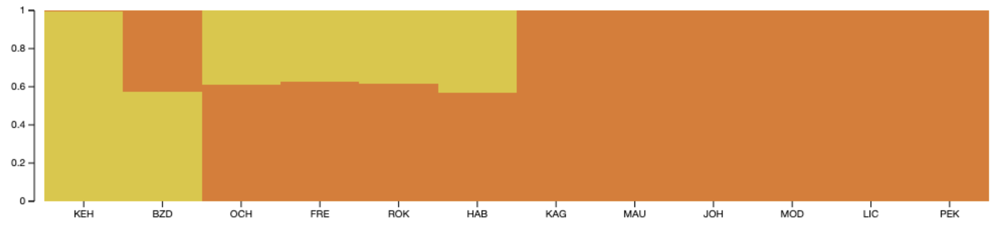
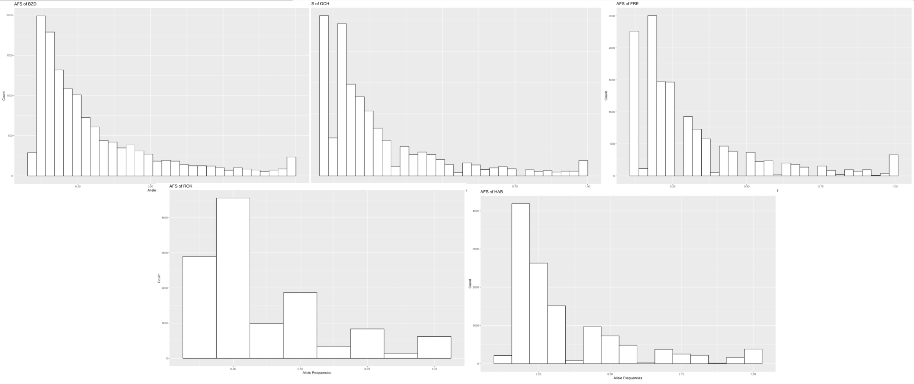

# LIFE4136 Rotation 3
Welcome to the GitHub repository dedicated to Rotation 3 of LIFE4136, where we delve into the intriguing realm of allopolyploidy following whole-genome duplication (WGD). Building upon the groundwork laid by Marburger et al. in 2019 (accessible via this link: https://www.nature.com/articles/s41467-019-13159-5), this platform houses an exploration of discernible patterns indicating the presence of allopolyploidy within hybrid populations.

Our research aims to provide insights crucial to the ongoing investigations led by the Marbuger et al. team, unraveling the mechanisms and significance of allopolyploidy arising from interspecific hybridization post-WGD.

Arabidopsis arenosa (referred to as 'arenosa' henceforth) stands as the sister species to Arabidopsis lyrata ('lyrata' henceforth). Both species manifest in diploid and tetraploid forms, with arenosa preceding lyrata in undergoing WGD. The post-WGD hybridization of lyrata with arenosa tetraploids, though occurring subsequently, introduces a degree of instability due to the infusion of novel genetic elements. Those hybrids that retain sub-genomes reminiscent of their parent species are recognized as allopolyploids.

Anticipated is the gradual reduction of allotetraploids to a diploid state over time, thus fostering increased genetic diversity within the Arabidopsis taxa.

The below code is to be ran in alternating R, Python and UNIX environments

## Contents
- [Dependencies](#dependencies)
- [Files Required](#files_required)
- [Initial Visualisation of Data](#initial_visualisation_of_data)
  - [Converting a VCF into a genlight object](#vcf_to_genlight)
  - [Sense checking data](#sense_check)
  - [Running an initial PCA](#initial_pca)
- [Filtering Data for Further Analysis of Trends](#filter_data_for_further_analysis_of_trends)
  - [Filtering with GATK](#gatk)
  - [Downloading files from a HPC](#hpc)
  - [Re-running the PCA](#second_pca)
  - [Testing geographical influence](#map)
  - [Running a PCA on individuals in a population](#third_pca)
  - [Further filtering with GATK](#further_gatk)
- [Relatedness Calculations](#relatedness_calculations)
  - [Nei's distances](#nei)
  - [SplitsTree](#splitstree)
- [Fast Structure](#fast_structure)
  - [Structure plotting](#structure_plot)
- [Allele Frequency Spectrum](#allele_frequency_spectrum)
  - [Creating an example allotetraploid](#allotetraploid)
  - [Creating allele frequency histograms](#histogram)

## Dependencies

<a name="dependencies"/>

* To run *Principle Component Analysis*, *Sample Mapping*, *Nei's Distance Calculations* and *Allele Frequency Spectrum Plots* **R Studio version 4.3.3** is needed, this can be downloaded here: https://cran.r-project.org/mirrors.html, simply navigate to your country and select the package compatible for your machine. Secondary to this, the following R packages need to be installed for the code to run:
  * **adegenet** version 2.1.10 or higher, simply install by typing: ```install.pacakges(adegenet)``` into the R command line
  * **adegraphics** version 1.0.21 or higher, simply install by typing: ```install.pacakges(adegraphics)``` into the R command line
  * **dplyr** version 1.1.4 or higher, simply install by typing: ```install.pacakges(dplyr)``` into the R command line
  * **ggplot2** version 3.4.4 or higher, simply install by typing: ```install.pacakges(ggplot2)``` into the R command line
  * **ggrepel** version 0.9.5 or higher, simply install by typing: ```install.pacakges(ggrepel)``` into the R command line
  * **leaflet** version 2.2.1 or higher, simply install by typing: ```install.pacakges(leaflet)``` into the R command line
  * **StAMPP** version 1.6.3 or higher, simply install by typing: ```install.pacakges(StAMPP)``` into the R command line
  * **tidyr** version 1.3.0 or higher, simply install by typing: ```install.pacakges(tidyr)``` into the R command line
  * **vcfR** version 1.15.0 or higher, simply install by typing: ```install.pacakges(vcfR)``` into the R command line
* To run *gatk*, **version 4.2.2.0** is required, first create a virtual environment: ```conda create --name /shared/apps/conda/bio2```, then download the package: https://github.com/broadinstitute/gatk/releases, and follow installation instructions. Other dependencies are:
  * **Conda version 23.11.0**
  * **Python version 3.8.12**
  * **SAMtools version 1.19.2** which can be downloaded here: https://www.htslib.org/download/
* To run the scripts for *fastStructure* **Python version 2.7.18** is required, to enable the use of this, create a virtual enviornmnet: ```conda create -y -n faststructure python=2.7.18```
  * **faststructure** version 0.0.0, which can be cloned here: git clone https://github.com/rajanil/fastStructure
  * **scipy** version 1.2.1, which can be installed in a python 2 environment by: pip install scipy
  * **numpy** version 1.16.5, which can be installed in a python 2 environment by: pip install numpy
  * **utils** version 0.9.0, which can be installed in a python 2 environment by: pip install utils 
  * **parse_bed**
  * **parse_str**
* To plot the *Neighbour Joining (NJ) Trees* **Splits tree of version 6.2.2-beta** is required which can be downloaded at: https://github.com/husonlab/splitstree6

## Files Required

<a name="files_required"></a>

* A **vcf** with all your samples, in this repository it is called 'Chrom_1_noSnakemake.lyrata.bipassed.dp.m.bt.1pct.ld_pruned.vcf'
* A reference **fasta file** to which your reads were aligned to, in this repository it is called 'lyrata.fasta'

## Initial Visualisation of Data

<a name="initial_visualisation_of_data"></a>

Load packages in R:
```
library(vcfR)
library(adegenet)
library(adegraphics)
library(tidyr)
library(dplyr)
library(ggplot2)
library(ggrepel)
library(StAMPP)
library(leaflet)
```
Set working directory:
```
setwd("[path_to_working_directory]")
```
Read in vcf:
```
vcf <- read.vcfR("[title_of_vcf].vcf")
```
Convert your vcf into a genlight object using the **create_genlight_object.R** script

### Check your data - this section is optional:

<a name="sense_check"></a>

```
aa.genlight
```
This will tell you basic information about your genlight object, for example how many individuals in sample.

If you want to see the individual names: ```indNames(aa.genlight)```

If you want to see the populations and number of them, run: ```unique(pop(aa.genlight))```

If you want to see the variety of ploidy in sample, run: ```unique(ploidy(aa.genlight))```

### Run an initial PCA:

<a name="initial_pca"></a>

This will allow for the discovery of potential trends in your data and allow for preliminary visualisation, instructions are in the **PCA.R** script.

This is what my first PCA looked like:


For reference, this figure from the Marburger paper, *linked at the top of the page,* shows some information on ploidy and purity of the new data (not all populations are included in this plot and SWA and HAL are SWB and HAB in the new data respectively):


At first it is difficult to see trends.

Try colouring by ploidy:
```
ploidy_labels <- factor(ploidy(aa.genlight))
s.class(pca.1$scores, ploidy_labels, xax=1, yax=2, col=transp(col,.6), ellipseSize=0, starSize=0, ppoints.cex=4, paxes.draw=T, pgrid.draw =F, xlab = "PC1", ylab = "PC2")
```


As you can see PC1 seems to relatively seperate diploids and tetraploids and PC2 hybrids from pure lyrata. However, this isnt a perfect pattern, many diploids cluster positively with PC1 (with the tetraploids). Furthermore, the tetraploids include hybrids (mixture of lyrata and arenosa) and a population genetically similar to arenosa (KEH). In the diploid population there are only pure lyrata, this means that the PCA could be unbalanced as there are no arenosa diploids to balance out the arenosa tetraploids.

## Filter Data for Further Analysis of Trends

<a name="filter_data_for_further_analysis_of_trends"></a>

### Filter your vcf with gatk:

<a name="gatk"></a>

Run the **filter_vcf.sh** script, changing the populations on line 11 to those you require, this also requires the **retrieve_IDs_updated_FIX.py** script.

### Re-run the PCA:

<a name="second_pca"></a>

In R, read in the vcf: 
```
vcf <- read.vcfR("tetraploid.vcf")
```
Convert to a genlight object using the function you have already defined from the **create_genlight_object.R** script:
```
aa.genlight <- vcfR2genlight.tetra(vcf)
locNames(aa.genlight) <- paste(vcf@fix[,1],vcf@fix[,2],sep="_")
pop(aa.genlight)<-substr(indNames(aa.genlight),1,3) 
```
Run a PCA (using the function you have already defined in **PCA.R** script) and plot:
```
pca.2 <- glPcaFast(aa.genlight, nf=300)
s.class(pca.2$scores, pop(aa.genlight), xax=1, yax=2, col=transp(col,.6), ellipseSize=0, starSize=0, ppoints.cex=4, paxes.draw=T, pgrid.draw =F, xlab = "PC1", ylab = "PC2")
```


Again PC1 seperates pure lyrata (left) from hybrids (centre) and populations closer to arenosa (right) and PC2 is potentially seperating populations via geography.

### To test if PC2 is seperating populations via geographical location you can use the leaflet() package:

<a name="map"></a>

```
mymap <- leaflet() %>%
  setView(lng = 15.2551, lat = 50, zoom = 5) %>%
  addTiles()

mymap <- mymap %>% addMarkers(lng = 14.722019, lat = 50.533611, popup = "BZD", label = "BZD",labelOptions = labelOptions(noHide = TRUE))
mymap <- mymap %>% addMarkers(lng = 10.582812, lat = 51.583498, popup = "SCT", label = "SCT",labelOptions = labelOptions(noHide = TRUE))
mymap <- mymap %>% addMarkers(lng = 16.248345, lat = 49.090359, popup = "TEM", label = "TEM",labelOptions = labelOptions(noHide = TRUE))
mymap <- mymap %>% addMarkers(lng = 14.482233, lat = 50.116151, popup = "PEK", label = "PEK",labelOptions = labelOptions(noHide = TRUE))
mymap <- mymap %>% addMarkers(lng = 15.611308, lat = 47.876394, popup = "OCH")
mymap <- mymap %>% addMarkers(lng = 17.285185, lat = 46.773573, popup = "GYE", label = "GYE",labelOptions = labelOptions(noHide = TRUE))
mymap <- mymap %>% addMarkers(lng = 16.038565, lat = 47.780388, popup = "JOH")
mymap <- mymap %>% addMarkers(lng = 15.426401, lat = 48.294661, popup = "KAG")
mymap <- mymap %>% addMarkers(lng = 16.269984, lat = 48.092981, popup = "LIC")
mymap <- mymap %>% addMarkers(lng = 15.552699, lat = 48.396128, popup = "LOI")
mymap <- mymap %>% addMarkers(lng = 15.560472, lat = 48.381430, popup = "MAU")
mymap <- mymap %>% addMarkers(lng = 16.267199, lat = 48.079485, popup = "MOD")
mymap <- mymap %>% addMarkers(lng = 15.349241, lat = 48.239088, popup = "PIL")
mymap <- mymap %>% addMarkers(lng = 15.393005, lat = 48.2742817, popup = "SCB")
mymap <- mymap %>% addMarkers(lng = 15.40084, lat = 48.3403, popup = "SWB")
mymap <- mymap %>% addMarkers(lng = 15.698451, lat = 47.937742, popup = "HAB")
mymap <- mymap %>% addMarkers(lng = 15.68304, lat = 47.9053, popup = "ROK")
mymap <- mymap %>% addMarkers(lng = 15.57118, lat = 47.99405, popup = "FRE")
mymap <- mymap %>% addMarkers(lng = 15.542146, lat = 47.816197, popup = "KEH")

mymap
```
SetView() is used to set the central coordinates of the map produced (the ones used in the above coordinates are central Europe) and the zoom is set to 5. Add in the latitude and longitude coordinates for your sample populations and their names. Coordinates for the data used in this study were obtained from the sample map provided, the specific coordinates were missing for BZD, SCT, TEM, PEK and GYE so they were estimated using the description of where they were sampled.


Using the labelOptions() function, the populations that were sampled outside the main cluster i.e. SCT, BZD, PEK, TEM and GYE were highlighted. On the PCA SCT plots most positvely with PC2 and was sampled the furtherst North, similar with BZD, TEM and PEK so this supports the hypothesis that PC2 seperates the populations by geography. However, GYE is further South from the sample cluster, but it doesn't have the most negative correlation with PC2 (this is LIC, MOD and JOH). Therefore, the relationship which PC2 describes is not fully clear.

### For further analysis you can plot the PCA by individuals:

<a name="third_pca"></a>

Run the **individuals_PCA.R** script.


### Filter out impure individuals

<a name="further_gatk"></a>

From observation alone it is clear to see that some individuals are plotting incorrectly. Individuals such as KAG.03tl plot close to the arenosa end of the scale (left) which is incorrect as we know from Marburger et al., it's pure lyrata. Impurity can occur due to many reasons, including: incorrect labelling of samples, sample mix ups in the lab, contamination etc. The below figure shows the other impure individuals, highlighted in yellow:


Re run the **filter_vcf.sh** script, changing the '-opre' flag on line 14 to 'filtered_tetraploid.args', adding the '-xcl' flag to line 15 followed by 'samples_to_exclude.args' which is a file provided at the top of the page consisting of the 9 impure individuals and finally change the '--output' flag on line 30 to 'filtered_tetraploids.vcf'.

Load this vcf into R (```vcf <- read.vcfR("filtered_tetraploids.vcf")```) and re-run the PCA using the **individuals_PCA.R** script


It is obvious by now that PC1 splits individuals closest to arenosa (left), hybrids (central) and pure lyrata (right), however it is slightly unclear what PC2 annotates. For example, why does BZD cluster on its own? Investigating relatedness may clear this up.

## Relatedness Calculations

<a name="relatedness_calculations"></a>

### Calculate Nei's distances

<a name="nei"></a>

Run the **NEI.R** script which consists of code provided by Ana  C. da Silva. The script plots the data as individuals and saves a .tre file in their populations for plotting in SplitsTree later. You can alter this in the code where it says 'plot(nj(aa.**ind**)...' and 'write.tree(nj(aa.D.**pop**)' change 'ind' and 'pop' accordingly. It is useful to plot as individuals to see if there are still impure data or any occurences which are different to what is expected.

The following plot is produced for the data I am using:


This tree is unrooted and follows the same trends as seen with the PCA and purity figure: LIC and MOD branch together as they are the purest lyrata, and share a recent common ancester. JOH (one of the new populations) branches with these two and clusters with them on the PCA meaning it must be a pure lyrata. The SCT, PEK and TEM populations, which we first saw clustering seperately on the PCA and then discovered a geographical similarity, branch as the same trio, showing a genetic liklihood. Other trends show and are easier to see when uploading to the SplitsTree software.

### SplitsTree

<a name="splitstree"></a>

After downloading SplitsTree (instructions at the top of the page) upload your .tre file to the SplitsTree software by navigating to [File] then [Open]. Once loaded select [Tree] then [NJ] to view your tree as a midpoint rooted neighbour joined tree. The output should look as follows:


Interestingly, SWB and MAU are outgrouped. From the Marburger et al., purity plot these individuals were annotated as approximate pure lyrata. These two populations likely diverged first after undergoing WGD and havent hybridised. Interestingly the population closest to arenosa (KEH) is nested amongst the lineage, this supports the theory that these lyrata tetraploids hybridised post WGD. The distance from KEH from its shared common ancestor with OCH is extensive, meaning the further aquisition of arenosa material occured after divergence. The allopolyploids form a monophyletic group (KEH to PIL) every other population external to this (except GYE) is relatively pure lyrata.

## FastStructure

<a name="fast_structure"></a>

Run the **faststructure_pipeline_final.sh** script on a HPC using sbatch (```sbatch faststructure_pipeline_final.sh```). The **retrieve_IDs_updated_FIX.py**, **reorder_str_file.py** and **Cochlearia_create_structure_file.py** scripts are required here. Along with your reference fasta file, your vcf file and an .args files with a list of populations you want to exclude (called samples_to_exclude.args, included at the top of the page). This script produces the following:
* A filtered vcf with only specific populations
* VCFs for each population in the filtered vcf you created. This becomes useful later on when trying to find signatures of allopolyploidy
* A .str file which works with faststructure
* Runs faststructure on the data and produces csv files for K values 2-4 in a format acceptable by the structure plot website 

NOTE
If you want to change the populations used you will have to change the pops used in line 61, 100 and 161

After running, download the csv files from the /final_omicsspeaks_output directory and upload them to structure plot: http://omicsspeaks.com/strplot2/



After preliminary testing, the populations SWB, GYE, TEM, SCT, LOI, PIL and SCB were removed as too many pure lyrata skewed the plot as there was only one pure arenosa in comparison. Some of the removed populations weren't fully pure lyrata however due to having a low percentage of arenosa genes, aren't likely to be allopolyploids. SCT and TEM were removed and PEK kept as they are closely related so one population surfices to represent the others. This package is not fully reliable as the data had to be filtered slightly to produce a worthy plot.

The plot is at k = 2, with KEH (far left) plotting as almost full arenosa (expected from previous knowledge), BZD, OCH, FRE, ROK and HAB plotting as hybrids and the rest plotting as pure lyrata (expected). 

## Allele Frequency Spectrum

<a name="allele_frequency_spectrum"></a>

Another way of investigating whether a population is an allopolyploid is by creating Allele Frequency Spectrums (AFS). Most commonly this is represented on a histogram. The output visualises the genetic variation within a population by describing the distribution of allele frequencies.

We know from previous research by Marburger et al. that allo- and auto- **hexaploids** plot on a histogram like such:

The **autohexaploids** plot with an exponential distribution which is right skewed, this is because the least frequent allele frequencies are the rarely occuring single nucleotide polymorphisms (SNPs). There are many different SNPs which occur close to a frequency of zero, causing this high left peak. **Allohexaploids** plot with a left, central and right peak. Again the data contains a high count of in-frequent SNPs which form the left peak. The central peak represents the alleles which occcur at virtually half frequency becuase on average hybrids contain 50/50 alleles from the two populations that merged and thus the frequently occuring alleles in one population are only half in the new population. And the right sided peak is formed from alleles which are conserved over both populations.

Autopolyploids always follow this exponential distribution, where the increase in sets of chromosomes only broadens the allele frequency distribtution. However, it is uncertain how a allo**tetraploid** would plot as the above histogram plots **hexaploid** data. To avoid potential overlooking of data and to draw reasonable comparisons, it is best to create an example allotetraploid to compare the sample data with.

### Creating an example allotetraploid:

<a name="allotetraploid"></a>

Return to R studio and download the files 'arenosa_632.txt' and 'lyrata_272_with_some_hybrids.txt' to the working directory you set earlier. These files contain mostly tetraploid data of arenosa and lyrata samples which we can merge to create an allotetraploid. If you are using different populations locate files which contain atleast allele frequencies at specific positions on chromosomes. Run the **synthetic_allotetraploid.R** script.


The filtered plot is set to allele freqeucy >0.1 to remove the skew created by SNPs. From the filtered plot it is clear to see there is still a central peak in allotetraploids it it just less defined than the allohexaploid plot (note this may be becuase of different sample or bin sizing). Now lets compare our data to this allotetraploid.

### Creating allele frequency histograms

<a name="histogram"></a>

Execute the **allele_frequency_plots.R** script in R, which also requires the execution of the **poly_freq.c** script in a Unix enviornment. The following five plots are for the five hybrid populations which plotted as roughly half arenosa and half lyrata in the fast structure plot. These can be viewed seperately in the Figures/ directory at the top of the page. Each of the histograms were plotted with a bin size according to the sample size and were again filtered for an allele frequency >0.1.



None of the populations seem to follow the same pattern as the example allotetraploid created above. There is a clear absence of a middle peak which is a conserved trait of allopolyploids. 
